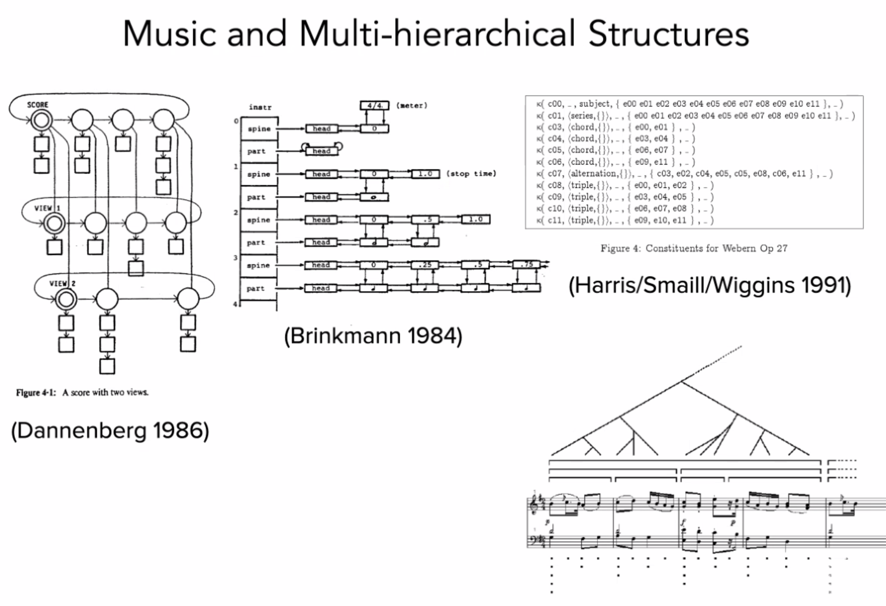

```
These notes were written for a presentation to be given at The Victorian College of the Arts, March 23rd 2020.

Duration: 1hr + 30m Q&A
```

## Who am I?

* Audio-visual Artist*
* Composer 
* Software Developer
* Animator
* Interested in extending conceptions and applications of music
* Pro Frank Zappa
* Anti Lars Ulrich
<!--- --->
 
  Also:
  * PhD Candidate at RMIT University
  * Max Certified Trainer
  * Director of Technology at Playable Streets
<!--- --->

Some examples of my previous work are [here](https://zeal.co/projects/luminesce),[here](https://zeal.co/projects/axis),[here](https://zeal.co/projects/obstinate).  

Questions for y'all:
* Who has heard of Max or Pure Data?
* Who has worked in a visual or text-based programming language?

### Foreshadowing...



I am mostly going to be talking about an area of research I have been working on involving the creation of  musical representations of motion - specifically that of gliding aircraft and similar activities which could loosely fall under the umbrella of *flow sports*.  I'll start with a teaser of the piece *Aileron One* and we'll discuss it in more detail as we go.


## Music+

#### What the hell is music anyway? 

Music infamously evades definition.   Perhaps the most often cited definition is from Edgard Varèse:

>Music is organised sound.

Though it doesn't take long to think of examples of sound that is organised, but usually not considered music.  Think industrial noises, or the warning beeper on a backing up truck. And there are many examples of music that challenge the definition, such as aleatoric music.

Instead of asking  *What is Music?*, what if we instead consider *What is **Musical**?*

To ruthlessly synthesise  musicologist [David Huron](https://mitpress.mit.edu/books/sweet-anticipation).

>Musicality is an aesthetic sense (qualia) elicited by the subconscious recognition of temporal patterns.
  
We use our past musical experiences to build probabilistic mental models to answer the following question from moment to moment:
*Given what has happened in a piece of music thus far, and the current context, what do we expect will happen next?*

✅ brain rewards itself

❌ brainstem reaction (arousal + positive valence)

The downstream effect is that **Predictability creates musicality,    surprise adds excitement.** If the piece is too predictable we get bored.  If it is too unpredictable, it doesn't sound musical.
  
Interestingly - this view of musicality is built atop predicting events in time, it is not constrained to sound.  Theoretically, other time-based artforms such as dance, poetry (*i.e. rap*), and video, can (i argue do) elicit musical experience.  As could other predictable  natural phenomena such as a leaf falling from a tree, or a rock skipping on a lake.

So let's define Music+  as simply **patterns in time**.  This can encapsulate composing, arranging, improvising, and performing. We often see multiple artforms and modalities presented alongside sonic musical performance.  From a music+ perspective,  all temporal (and contextual) elements of these artworks can be considered to be musical elements able to be composed, arranged, performed, or improvised.





Out of the various modalities, the relationship between vision and sound is likely the most formalised.

* John Whitney  (Visual Music)
* http://www.jaroslawkapuscinski.com/
* https://www.freidaabtan.com/
* Jonathan Sterne's Audio-visual Litany
* Michel Chion's Audio-vision and Visu-audition

Some of my previous work has been attempting to extract the musical qualities present in visual stimuli or vice versa - translating between vision and sound, sound and vision.


Adelaide to Melbourne - expressing audibly changes in vision over time


Luminesce - expressing visually changes in sound over time


But here are other modalities with latent musical potential
 
* Smell
* Touch
* Temperature
* Soma
* **Proprioception**

Proprioception is our sense of our own bodies movement.  We can also consider our empathetic response to the movement of others.

Motion is change in position over time.  Thus patterns in motion *are* music+.

Other intermodal composers often talk about sonic or visual motion (Kapuscinski, Whitney)

What is super cool about motion is we all have predictive models about the physical world - throw a ball up, we expect it to come down. This predictability gives a substrate for musical experience.

```
Ball example.

Glider example.

```

  
So.... let's say we want to build a musical system that takes as an input some kind of motion, and as an output produces some sort of sound.  If we take on this task, we are leaving behind the safe confines of deterministic music and entering the hazy abyss that is...

---

  ## DYNAMIC MUSIC

* dynamic music - tracy redhead, florian thalmann
* encapsulates adaptive, generative, stochastic music and more.

Recognises music is fundamentally multi-hierarchical

The above collection of diagrams curated by Florian Thalmann.

### Tools for Dynamic Music composition


* Music for games is a major domain of Dynamic Music. Most common tools are [FMod](https://www.fmod.com/), and [WWise](https://www.fmod.com/).
* I wanted more granular control so I developed my own suites of software tools using, initially in [Max](https://cycling74.com).


---

  ## SPATIAL METACOMPOSITION

* Composing for motion in digital virtual space.
* Distinct from Spatial Music.
* Create a multidimensional musical space. 
* Explore that space to render a musical result.
* Each performance of the metacompostion may be different, so you are in fact composing an infinite set of musical possibilities.

Space = Sound by Rolf Gelhaar is likely the first ever Spatial Metacomposition:


Dimensions of this compositional space do not necessarily conform to those of physical space.  It is *non-euclidean* and of arbitrary dimensions.

``````
Example: compound rotation
``````

```
Example: Composing against axes of arbitrary continuous data.

```

Start with a two dimensional composition space: position X and position Y.  

What happens when we change one axis to acceleration? or temperature? or character health? or radiation level?
  
Now we are beginning  to work in  a generalised, multi-dimensional composition space.  Binding events to points in space helps create predictability, but we have the creative scope to break this expectation


---

## Composing music for virtual space




Aileron One is an interactive musical work that uses draws on audio variometer - an instrument used by glider pilots to perceive the vertical velocity -  as a jumping off point for the exploration of the musical sonification of gliding flight. 



### Aileron

I developed the [Aileron](https://github.com/zealtv/Aileron) tool suite with the aim of being able to quickly compose spatial meta compositions.   Aileron One was written as a an investigation of the tools as well as the concept of spatial metacomposition.

My primary take away from this was changes in velocity can change our musical perception (Stockhausen's unified musical time spectrum). We can manage this by bracketing velocities and composing transitions between these brackets, akin to metric modulation but in space rather than time.

*This principle applies to the rate of change of any continuous data source, not just position*



  The two-dimensional grid of Ableton's session view became too cumbersome so I decided to build atop a different framework which led to the development of Elevon.
  
### Elevon 🛩

For the development of Elevon, I chose to work in Pure Data because it is cross platform and embeddable (raspberry pi).
This project then split in two -  [elevon](https://github.com/zealtv/elevon) for structuring music against n-dimensions of arbitrary continuous data.  Music making tools became  [bop](https://github.com/zealtv/bop).

### bop 🐦




  
---
## Takeaways 🍱

* Musical perception can be elicited through other senses - although this may not be consciously recognised by the experiencer.
* Musical perception is based on past experience - we can (and do) push at the boundaries of musical perception to build the basis for new musical experience (Coltrane,  the trajectory through musical history of consonance to dissonance, Stravinsky).
* Technology opens a myriad of creative possibilities - we build upon the existing collective musical memory to slowly expand humanities palette of aesthetic experience.
* The medium of Dynamic Music allow us to create musical representations of arbitrary data.  When applied to motion data we are able to create musical perceptions of changes in position over time.
* The virtual space in which our metacomposition exists is non-euclidean by nature, and of arbitrary dimensions.

---
## Let's discuss

* What applications of Dynamic Music can you think of?
* Can you think of any artforms, human pursuits, or natural phenomenon that have musical qualities, yet aren't usually considered music?

---

# Tabs for this talk

https://zeal.co/about/

https://zeal.co/

https://en.wikipedia.org/wiki/Visual_programming_language

https://www.youtube.com/watch?v=qfVjxAudeio

https://en.wikipedia.org/wiki/Definition_of_music

https://mitpress.mit.edu/books/sweet-anticipation

https://www.youtube.com/watch?v=l1nR9ZJaA90

https://youtu.be/QgPrnCmsGY8?t=69

https://en.wikipedia.org/wiki/John_Whitney_(animator)

https://www.youtube.com/watch?v=TbV7loKp69s

https://zeal.co/projects/adelaide-to-melbourne/

https://zeal.co/projects/luminesce/

http://www.doyletics.com/arj/12signss.jpg

https://en.wikipedia.org/wiki/Proprioception

http://www.jaroslawkapuscinski.com/work-mondrianvariations.html

http://www.tracyredhead.com/?q=content/semantic-machine

https://zeal.co/notebook/assets/Pasted%20image%2020220322201412.png

https://www.fmod.com/

https://www.audiokinetic.com/en/products/wwise

https://cycling74.com/

https://www.youtube.com/watch?v=tJyutKQEpLk

https://www.youtube.com/watch?v=ywen9LQ6Wn4

https://zeal.co/notebook/assets/Aileron_One_Arrangment.png

https://www.youtube.com/watch?v=QEDEZbJYuZo

https://github.com/zealtv/Aileron

https://www.youtube.com/watch?v=UVnK7ySaeNc

https://github.com/zealtv/elevon

https://github.com/zealtv/bop

https://youtu.be/GnQuqaytKiI?t=14 (live demo)

[oh, you found me](https://youtu.be/l7rjRDxscmA?t=792)