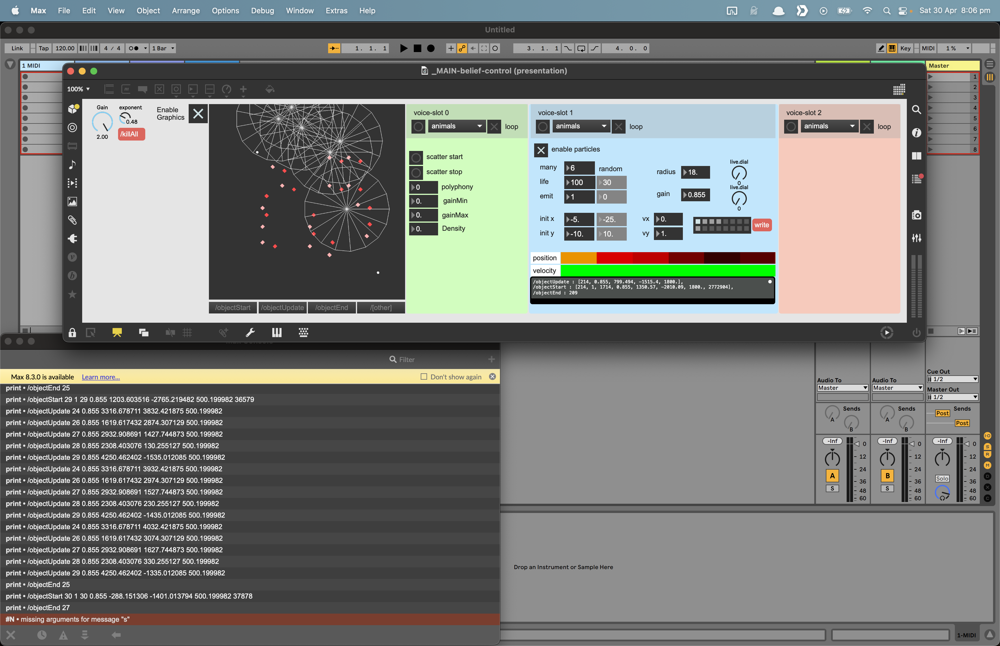

Continuing work on a system I was exploring earlier here  \[[composing with particles](composing%20with%20particles.md)], I was working with TouchDesigner.  Here I have moved to Max using its native particle system: \[jit.shiva] and \[jit.vishnu].  The patch processes the particle matrix to detect particle births, deaths, and movements, and transforms that data to an OSC schema for moving virtual sound objects through a distributed speaker array. 

The speaker array system consists of several raspberry pi zeros running  [HappyBrackets](https://www.happybrackets.net/wp/), each powering two speakers.

Up to now, I have been taking a primarily generative approach. 
 After testing hands on in the space in the space, and getting  experiential, I feel the system would greatly benefit from some hands-on playability.  
 
 My current thinking is to combine note input from a keyboard or grid controller, with spatial touch controls in MIRA https://cycling74.com/products/mira.  I currently run MIRA on a little touchscreen ultrabook via the firefox and it works great.

