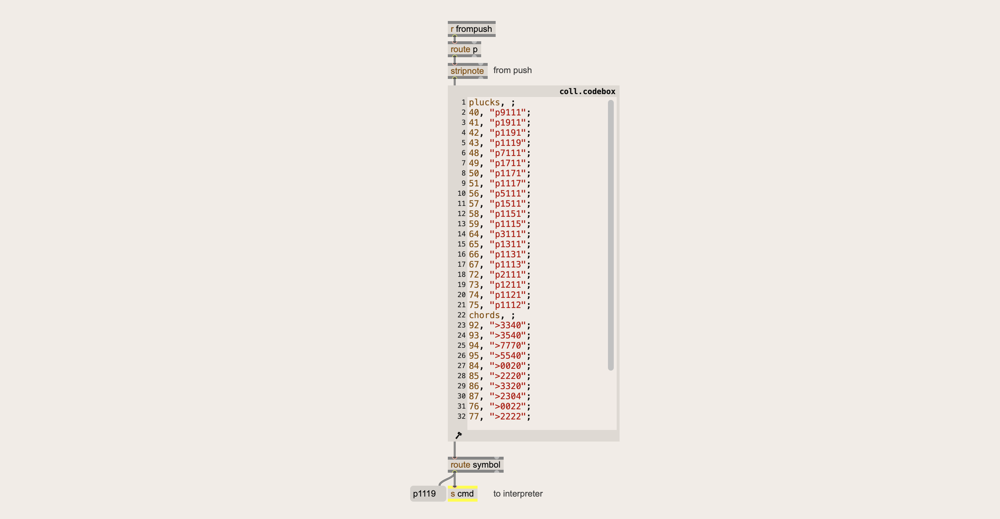



This is a common trap/feature/bug/quality of working in Max - the tension between left-hemisphere analytical tasks, and right hemisphere creative tasks.  When you're in the creative flow of music making, the last thing you want to do is stop to program your own reverb~.  You might make an amazing reverb, but that is time you're spending not making music.  Both creating an amazing reverb, and creating music are both perfectly valid endeavours, the key is focussing your attention on the thing you actually want to be doing.

I enjoy both the technical and creative sides of the Max-programming coin, but more recently I have been craving some time in my right hemisphere.  This usually means firing up Ableton and just playing around, or picking up the uke.  Hopefully if there's a Max tool I need whilst in creative flow, I or someone else has already made and I don't need to get lost in the reeds firing up a patcher.

Some of the new features in Max 9 chop down these reeds, giving fast access to great sounds without needing to get ones hands dirty with the DSP if that's not one's current vibe.

The Ableton-derived objects in Max 9 are easy to use and sound excellent.  If you need reverb, you have a selection Ableton's reverb algorithms ready to drop in and tweak.  If you need distortion, Ableton's roar is one object away.  Couple this with the handy sfizz~ object for loading sample-based instruments in .sfx format, Ableton's drift synthesizer as a single native object, and you have a high-fidelity, and high-level toolkit that leaves the left-hemispheric power of Max at your fingertips when you need it, whilst helping you stay in right-hemispheric creativity-mode when the focus is aesthetic.

These sonic upgrades have had me doing more musical exploration in Max than in the past - when most of my Max-time was dedicated to interaction or tool development.  Now Max feels a little closer to a non-linear DAW, somewhere I want to make music. 

# Exploring Chords as Numbers
An idea I have been exploring is describing chords and other musical descriptors as floating point numbers.  I've been referring to these as **[semisteps](intermals.md)**. They work like this:

- The number to the left of the decimal defines the root in semitones. 
- Each digit to the right of the floating point defines a new voice that many semitone above the previous voice.

```
-- THE SEMISTEP --
   -12.074   
     / \ 
    /   Three additional 
   /    voices 0, 7,
  /     and 11 semitones 
 /      above the root.
|
Root twelve semitones below 
a reference pitch.

```

Defining chords in this way has limitations - you cannot, for example, describe intervals beyond a major 6th (nine semitones) - but the format is flexible enough to describe a large space of possible voicings in a very condensed form.

# From Semisteps to Frets

The trick being employed by the semistep concept is to use the decimal point to split the floating point value into multiple components - the signed integer on the left, and individual digits on the right.  This same trick can be used to define a whole range of different things - for example fingering on a fretboard.

Consider a 6-string guitar in standard tuning (EADGbe).  The floating point value 0.22100 could represent frets on the 1st through 6th strings - the E major cowboy chord.

Defining chords in this way has the advantage that you can have multiple strings playing the same note - something that is not easily doable in a MIDI piano roll without resorting to duplicating channels.

But importantly, guitars need to be tuned. And so this method of notation requires a way to tune the strings.  A semistep is a good fit for this task.  Standard guitar tuning would look like:
**0.55545**.

# From Frets to Finger-picking
Since all we are doing is taking a number, splitting it into digits, and assigning each digit to a string, we can also encode multiple channels of velocity to a single number.

In this case the digit values can define a velocity, with 0 and 1 having special meaning.
```
| digit | meaning                    |
| ----- | -------------------------- |
| 0     | mute string                |
| 1     | let ring                   | 
| 2 - 9 | velocity lowest to highest |
```

so 9.00000 would mean strike the lowest string at maximum velocity and mute every other string. 9.99999 followed by 0.10000 would mean strike all strings at maximum velocity and then mute all but the second string.

Suddenly we have notation for finger picking.


# Inadvertently Reinventing Tracking (but weirder?)
The  methods above all encode some musical property - chords, fret fingering (and string tuning), finger picking - as a floating point number.  To be able to use these in combination we can replace the decimal point with another symbol denoting what is being represented.  Additionally, because this requires representing these values as strings rather than floats, we can move the symbol to the front of the string for readability when doable.

```
| symbol | what is encoded | example | note                                 |
| ------ | --------------- | ------- | ------------------------------------ |
| .      | semistep        | 0.43    | major triad from the root            |
| >      | frets           | >022100 | E major                              |
| =      | string tuning   | =055545 | Standard guitar tuning               |
| p      | finger picking  | p222222 | pluck all strings at lowest velocity |
|        |                 |         |                                      |
```

# Inadvertently Reinventing the Casiochord (but weirder)
From here we can start to build chord progressions and picking patterns.  We end up decoupling the pitch and amplitude control in a similar way to a stringed instrument - one hand takes care of pitch (holding down the frets), the other hand takes care of amplitude (plucking and muting the strings). What we get for free are guitar-like articulations like hammer-ons, pull-offs, slides, that all come from doing different things at different times with the left and right hands.

Textedit objects serve as tracker columns storing a sequence of commands.  Each tracker column connects to a shared transport but have separate subdivision selectors.  In the video below the left column has starts with a chord progression in a mix of semisteps and frets, and the middle column has a 3/4 finger picking pattern.  These patterns can be overwritten via the t1, t2, and t3 receives which handily can be set live from the Max console thanks to the new REPL.  The cmd receive bypasses the tracker and sends the command directly to be interpreted.



# Reinventing the Omnichord (on purpose this time)

One nice thing about such compact notation is it allows fast and easy mapping.  It was a modest amount of work to map Push pads to both chords and plucks allowing for omnichord style interaction.  

The mapping is done in a single col object that takes incoming midi notes and then with either a picking command, a fretting command, or a semistep.  All of these different can be sent to the same send since the patch knows how to distinguish and interpret them.  Makes for a very flexible and very playable setup.



