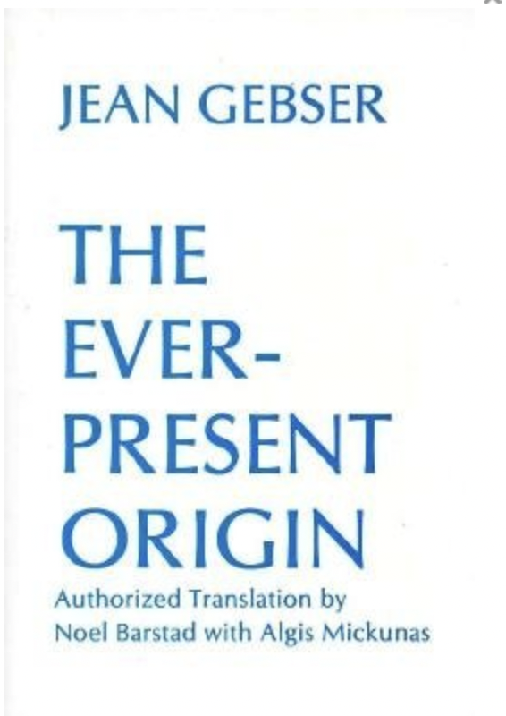

 

Maybe it's just me but it seems like there is a collision of ideas going on.  Some of the ideas go by terms like *meta-modernism*, *integral*, *process philosophy*, *process theology*, *pan-experientalism*, *panpsychism*, *organic cosmology*, and probably a lot more.  

I recently came upon *The Ever-Present Origin* by Jean Gebser - a book hypothesising historical leaps in consciousness awareness throughout human evolution.   He described observing the emergence of a new consciousness structure beginning to be expressed through art, scientific discovery, philosophy, etc. from the 1940's.

Gebsers conception of a mutating consciousness structure fits very neatly within the context of Alfred Whitehead's Process Philosophy - or organic cosmology - which situates the human within a self-experiential universe.



This is a panpsychist framework that considers conscious experience to be fundamental to the universe, a radically different ontology to contemporary materialism. 

And although the leap to reconsidering the fundamental nature of reality is rather drastic,   isn't that what our current meta-crisis calls for?  Not only that, but an "experience *is* reality" attitude encourages a radically all-affirming,  all-inclusive world-view, and we could do with a bit of that too.

An ontological flip like this tracks perfectly with Gebser's integral consciousness structure, which itself was incorporated into Ken Wilber's formalised Integral Philosophy.

And then there are the various states of consciousness - dreams, hypnagogic hallucinations, psychedelic experiences - if experience is fundamental, everything experienced in these states is some kind of *first-class* *real*.  

So how can we fit that into a science-shaped hole?

This article I think sums up well the leap from new ontology to a new frame of reality - a new science: https://runningfather.wordpress.com/2013/03/22/new-to-the-philosophere-panexperiential-holism-and-its-implications-by-justin/

Jacques Vallee exemplifies this attitude of *transrationality* with flare. 



I find this emerging world view not only a coherent and disorientating reflex to the meta-crisis, but also a supremely optimistic one that asserts our free will and creativity.  A new new-age with some actual philosophical heft.

https://www.joelightfoot.org/post/the-metamodern-solarpunk-manifesto

🌳👁✨🌳👁✨🌳👁✨🌳👁✨🌳👁✨🌳👁✨🌳👁✨











