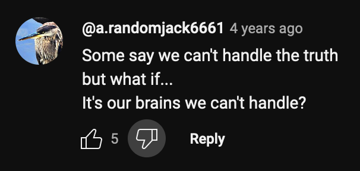



An amorphous term floated around ufo twitter... "high strangeness".  This term is so broad as to suck in every single thing that does not conform to our expectations of reality.  That is anything beyond the (post/)modern worldview.  This world view is a pretty good rule of thumb as the as far as things go, but becomes unstuck when confronted with anomolies.  Paradox emerges.

Some things that are impossible to imagine, might infact be possible.

We have many credible witnesses to seemingly impossible events.  How can we overcome the limitations of imagination and of skepticism to determine how these events might *actually* intersect with shared reality?  If such a shared reality exists?

Here is where I would place the Ariel School encounter.

In 1994, over 60 children claim to have experienced an alien encounter.  Their description of these alien beings aligns closely with the beings of our contemporary mythology. And their testimony is very compelling.

The default skeptical stance is that which allows us to collapse the dissonance of unbelievable reports. 
That the reports are likely a collective psychological episode, caused by the influence of adults including a prominent psychiatrist, leading to conformity amongst the descriptions and depictions of the encounter given by the children.

The testimony of the children seems to me as inarguably genuine, sincere, honest.  Few people would perceive these kids as not completely believing everything they say.   And it would take an evil genius to brainwash children into delivering such nuanced, perfectly imperfect, and overwhelmingly corroborating reports.  Reports that they attest to two decades later.

But what else are we supposed to believe? - because the idea that creatures of our contemporay mythology might actually exist is also completely unbelievable.  How do we navigate this multidimensional truth-space?  We are forced, kicking and screaming, to keep an open mind.

[arielphenomenon.com](https://arielphenomenon.com/)





















