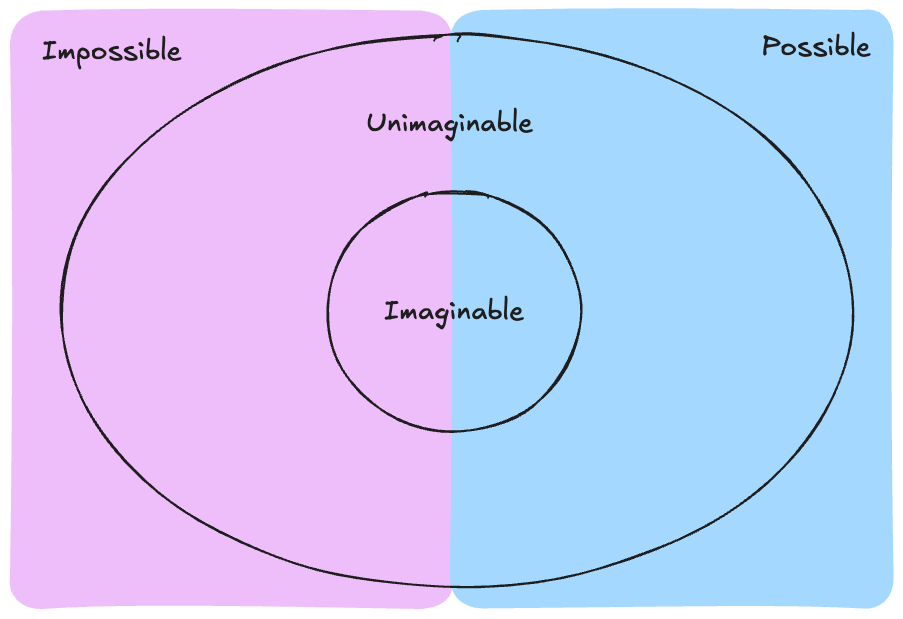

Within the realm of the things we can possibly imagine to exist, there are things that are both possible and impossible.  Then there are also those things beyond our ability to imagine them... and some of those things might be possible. 

Try to imagine something that is impossible to imagine.  That thing you can't imagine? It might be possible.

We have many credible witnesses to seemingly impossible events.  How can we overcome the limitations of imagination to determine how these events might *actually* intersect with shared reality?

Here is where I would place the Ariel School encounter.

In 1994, over 60 children claim to have experienced an alien encounter.  Their description of these alien beings aligns closely with the beings of our contemporary mythology. And their testimony is very compelling.

The default skeptical stance - that which allows us to collapse and dismiss the dissonance of unbelievable reports - is that this was a collective psychological episode, caused by the influence of adults including a prominent psychiatrist, leading to conformity amongst the descriptions and depictions of the encounter given by the children.

If we place a skeptical mirror up to this skeptical hypothesis, especially after viewing the children's own contemporaneous video interviews  - it is just such a fucking stretch. The testimony of the children seems inarguably genuine, sincere, honest.  It would take an evil genius to brainwash children into delivering such nuanced,  perfectly imperfect, corroborating reports.  Reports that they attest to two decades later.

But what else are we supposed to believe? - because the idea that creatures of our mythology actually exist is also completely unbelievable.  How do we navigate this multidimensional truth-space?  We are forced, kicking and screaming, to keep an open mind.

[arielphenomenon.com](https://arielphenomenon.com/)




















