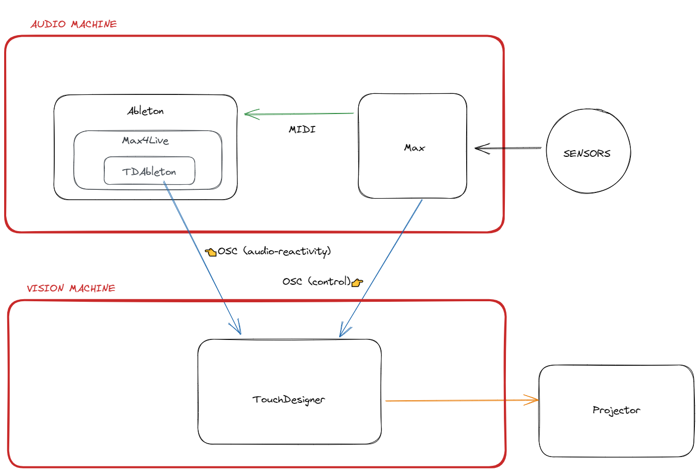
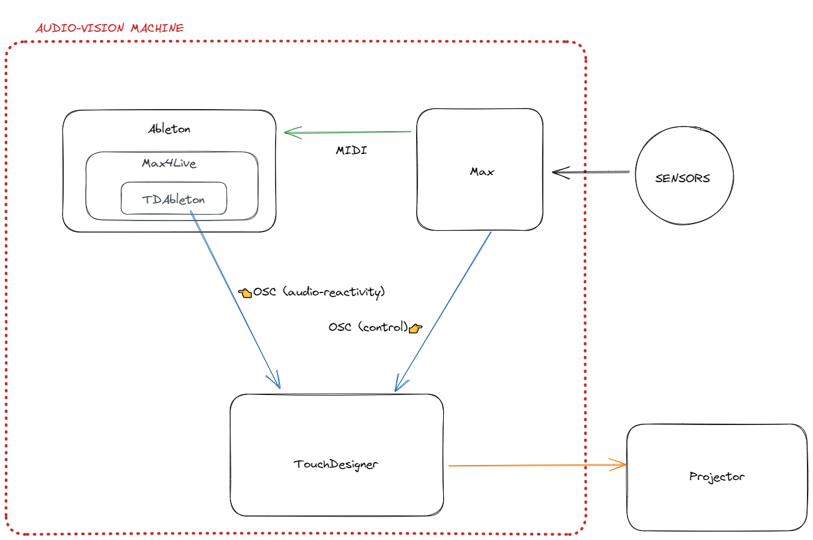

# An Introduction to Interactive Audio-Vision

Let's look at a general-purpose stack of tools for interactive video projection and integrated audio.  We will look at running the stack on a single machine, as well as distributed across a network, as the scenario may call for.

- TouchDesigner will be the minds-eye of our system, generating and processing vision, then outputting video for projector.
- Ableton will be the heart of the system, dishing out sequencing commands, as well as sending audio to our interface.
- Max will provide the neurophysiology, reading and interpreting data from our sensors before sending high level messages to the rest of the system.  This is where our interaction logic will live.

<!--[ac-stack-overview](ac-stack-overview)-->
Across two machines:

On one machine:

# Tools
We'll make use of the following:
- [TouchDesigner](https://derivative.ca)
- [Ableton](https://ableton.com)
- [Max](https://cycling74.com)
- [TDAbleton Plugin](https://docs.derivative.ca/TDAbleton)
- A camera or game controller as a sensor
- Media creation tools for creating source material

### extra stuff ...
##  Phones as wireless sensors
These send sensor data as OSC over a WiFi network.  This enables all sorts of stuff: geolocked content, motion sonification, environmentally responsive works, etc.
We can get things like:
- GPS
- rotation
- acceleration
- temperature
- light
- NFC

iOS: [gyrosc](https://www.bitshapesoftware.com/instruments/gyrosc/)  
Android: [sensors2OSC](https://sensors2.org/osc/)

## Phones as wireless cameras:
The NDI protocol allows sending high-resolution over a network.  Apps on iOS and Android turn the device into a very capable wireless streaming camera.

iOS and Android: [ndi-hx-camera-app](https://www.ndi.tv/products/ndi-hx-camera-app/)

## Game controllers
Many game controllers compatible with your operating system can be read into programs like Max and TouchDesigner.  You can leverage the R&D that has been put into developing ergonomic and responsive human interfaces.  **Max** is a great tool for bringing in these sort of human interface devices and sending out OSC messages.

## USB keyboards
We can hack switches on to the PCB of old USB keyboards to get quick, simple button inputs.  It is workable solution much of the time.  

## Video recapture applications
These let us record application output

x-platform: [OBS Studio](https://obsproject.com/)

For Windows: [Spout Recorder](https://www.lightjams.com/spout-recorder.html)  
For OSX: [Syphon Recorder](https://syphon.info/recorder)

---
## Future Directions
🍪 Later me might think about extending the stack by bringing game engine textures into TouchDesigner from Unity and Unreal.  

🍪 We could look at integrating live video feeds over WiFi using NDI.  

🍪 We could devise novel methods of interaction.

🍪 We might also look at various approaches to projection mapping inside and outside of TouchDesigner.

# Next

[text along paths in touch](text%20along%20paths%20in%20touch.md)