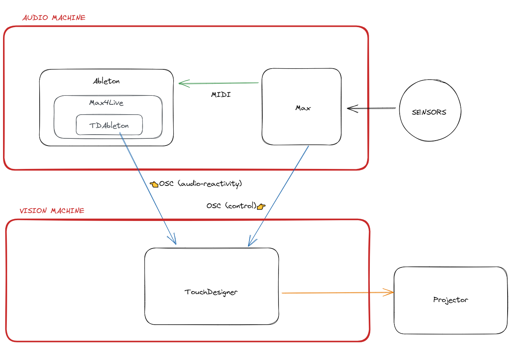

# An Introduction to Interactive Audio-Vision

Let's look at a stack of tools for interactive video projection and integrated audio.  We will look at running the stack on a single machine, as well as distributed across a network, as the scenario may call for.

- TouchDesigner will be the minds-eye of our system, generating and processing vision, then outputting video for projector.
- Ableton will be the heart of the system, dishing out sequencing commands, as well as sending audio to our interface.
- Max will provide the neurophysiology, reading and interpreting data from our sensors before sending high level messages to the rest of the system.  This is where our interaction logic will live.

<!--[[ac-stack-overview]]-->

We'll make use of the following:
- [TouchDesigner](https://derivative.ca)
- [Ableton](https://ableton.com)
- [Max](https://cycling74.com)
- [TDAbleton Plugin](https://docs.derivative.ca/TDAbleton)
- A camera or game controller as a sensor
- Media creation tools for creating source material

---
## Future Directions
Later me might think about extending the stack by bringing game engine textures into TouchDesigner from Unity and Unreal.  We could look at integrating live video feeds over WiFi using NDI.  We might also look at various approaches to projection mapping inside and outside of TouchDesigner.

