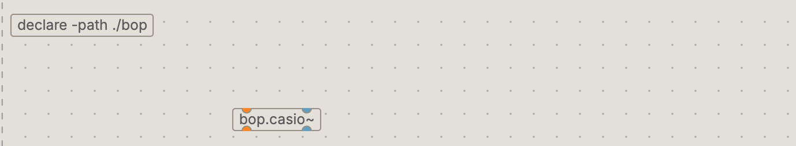
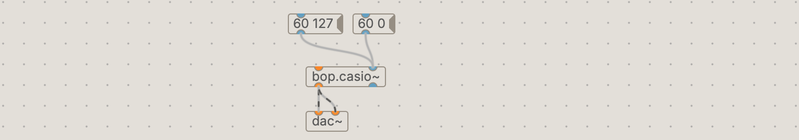
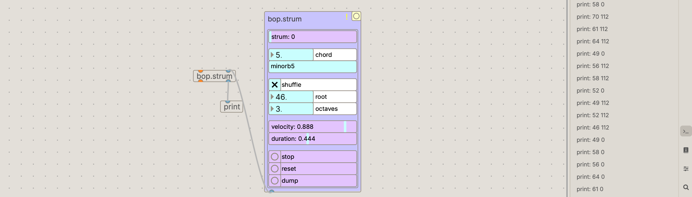
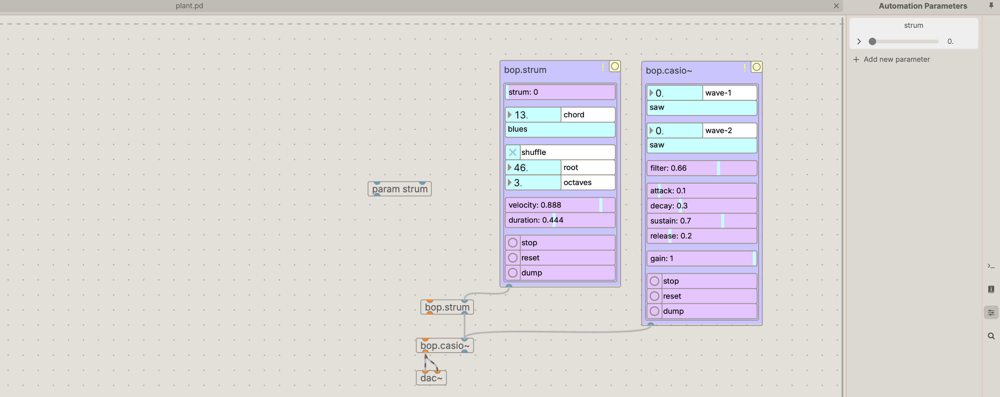
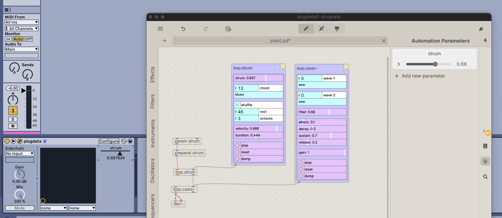

We are going to build a simple interactive sketch using bop for Pure Data.  This will demonstrated in Ableton but can also be done in your VST host of choice.

## Setup
1. Create a new folder on the Desktop for your project and name it `plant`
2. Download the bop library from the releases tab https://github.com/zealtv/bop and unzip it in the space-mixer directory.  Rename the extracted folder to 'bop'
3. Open your DAW and add PlugData as a VST3 effect
4. Open the Plug Data VST, create a new patch and save it as `~/Desktop/plant/plant.pd` 

## Using bop modules

bop consists of Pure Data abstractions - these a simply Pure Data patches that are prebuilt to make our patching lives easier.  To let Plug Data know we want to use the files in the bop folder we use the `[declare -path ./bop] ` object.   This will let us create bop modules as if they were regular PD objects.
- Add the `[declare -path ./bop]` object.
- Then create a `[bop.casio~]` instrument.

`[bop.casio~]` is a casio-style phase distortion synthesizer. The left outlet outputs audio signal.  We can send MIDI notes to either inlet to produce sound.
- Add a `[dac~]` object and connect its left and right channels to the output of `[bop.casio~]`.

- Create a message box with the contents `[60 127(`, and another with the contents `[60 0(`.  These are MIDI notes at the pitch C4 with velocity of 127 and 0 (note-off) respectively.  
- Connect them to either inlet of the `[bop.casio~]` , lock your patch, and click the message boxes to send the MIDI notes to the synthesizer.

Note that bop.casio~ is four note polyphonic and can play multiple instances of the same pitch, so if you send it multiple C4s, you might need to send multiple note-off messages to get it to stop.  Make some more note messages and see if you can generate some interesting chords.

All bop modules have a graphical user interface that can be used to tweak their parameters.  

- Create a `[bop.ui]` object and connect its outlet to either inlet of `[bop.casio~]`, then click the yellow button.

You will see `[bop.ui]` expand into an interface with all of the parameters for `[bop.casio~]`.

Play with the parameters to get a sense of what they do and sculpt a sound you like.

## Generating MIDI notes with the bop.strum

The `[bop.strum]` provides an easy and interactive way of producing strumming chords.
- Somewhere above `[bop.casio~]`, create a `[bop.strum]`object as well as another `[bop.ui]` object.  
- Connect `[bop.ui]` like you did with before to access the parameters of `[bop.strum]`
- Create a `[print]` object and connect it to the right outlet of `[bop.strum]`, then move the 'strum' parameter and look in the console to see the output.

You should see a stream of MIDI notes being printed in the console.  
- Connect `[bop.strum]` to `[bop.casio~]` and experiment with the parameters.

## Mapping bop parameters from our DAW
All parameters in bop can be controlled with messages.  The format of these messages consist of the parameter name followed by a value.  For example sending `[bop.casio~]` the message `[filter 0.5(` will set the filter parameter to a value of 0.5.  Let's use Plug Data to automate the `strum` parameter from our DAW.

- Open the 'Automation Parameters' panel by clicking the icon on the right sidebar.

- Click '+ Add new parameter', name it 'strum', then drag it above our `[bop.strum]` object.

The `[param strum]` object that is created will output a value between 0 and 1 when the parameters slider is moved.

- Connect the output of `[param strum]` to a  `[prepend strum]` object to construct our parameter message and connect this to either inlet of `[bop.strum]`.  
- Move the 'strum' parameter slider in the 'Automation Parameters' panel and test you can hear the notes changing.

Returning to Live
- Click the triangle icon on the Plug Data VST to unfold device parameters, then click `configure` for Live to learn the parameters we want to control from our PD VST.
- With 'configure' active, move the `strum` slider.  Live will instantiate a new strum parameter that is mappable and automatable from Ableton.

- Click `configure` once more to deactivate learning mode.  
- Right click on the Live 'strum' parameter, select 'Edit MIDI Map', and move a knob or slider on your MIDI controller to map it to your VST, then exit MIDI map mode.

You have now mapped a physical control through Live, through Plug Data, and into bop 🤯
