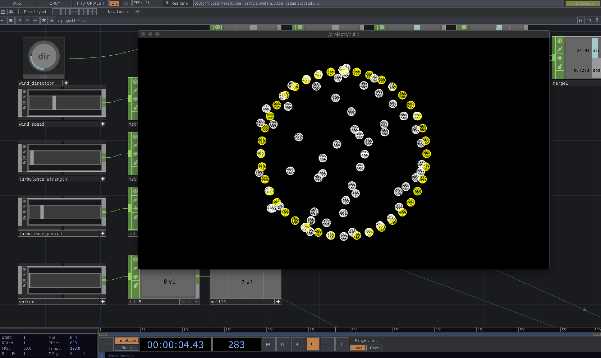
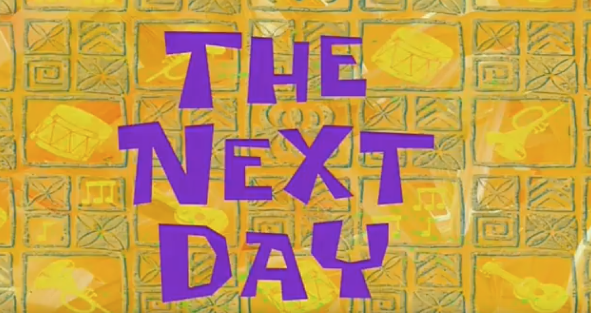
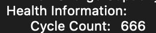

I am working on a project that requires me to move sounds around an irregular multi-speaker array system.  The aesthetic aim is to have sounds travel through the space as if they are on the wind.

OSC will be used to control these virtual sound objects, and as such, the piece will be composed as streaming OSC instructions.

An OSC specification has been developed and I am now  investigating what tools I might use.  My first stop was touch designer which initially showed promise - it was easy to get some particles and high level realtime control going - but lacked an easy method for triggering events on the birth and death of individual particles.



Next stop was an old time favourite tool openFrameworks.  Looking at [ofxaddons](ofxaddons.com) threw up some existing particle libraries, many of the are very old and being short on time I'm not particularly (ha!) keen on writing a system my self, forces and all.  A visual tool is a better fit.

Briefly considered [Max](cycling74.com) but I know how messy that could get... game engines are a better option here, options being Unity, Unreal or Godot.

Godot is appealing in as much as it is **tiny** but its particle tools seem immature at this point in time.  So we're down to the big cats - Unity or Unreal.  Both seem capable.  

Unity offers [this](https://assetstore.unity.com/packages/vfx/particles/participle-107695)particle library which exposes birth and death events.  And Unity has a healthy ecosystem of OSC tools.  But in this case I am leaning towards Unreal as I really enjoyed using it in a [previous project](https://zeal.co/projects/luminesce) and its Niagara particle system looks very sophisticated.  If I am able to get Niagara spitting out OSC messages per particle, I can then leverage the complex behaviours already built into the system meaning more potential sonic expression.

[This](https://www.youtube.com/watch?v=aA_8NLzbUTA&list=PLomQNLPOWtzYXU_pRIUVVEV9uY7bjENZ5&index=46)  youtube tutorial helpfully describes the process of extracting per-particle information on arbitrary events which would suggest what I want to achieve is possible.  One hiccup may be my ageing macbook which may force either a change of software or an upgrade of hardware. 

---

After a short break - a brain wave!  Node for Max could be a good option here.  A JS particle system could be ideal.   [tsParticles](https://github.com/matteobruni/tsparticles) seems to be the clear leader - though lacks forces like wind.



After some experimenting in Unreal - it seems accessing the particle ID in blueprints isn't as straight forward as I would like.  So I returned to TouchDesigner.  I think I may found an efficient enough approach to detecting particle birth and death events via python.

---

by the way... my ten year-old MacBook Pro's battery just hit this terrifying milestone:


---


After a difficult day of programming on too little sleep, I managed to detect life events for particles in touch designer.  The approach involved creating two DATS, one storing the particles of this frame, the other storing particles of the previous frame, and comparing them in different ways to detect which particles were unique to each DAT, and which were in common.  Those in common to both a copied into an "update DAT", those present this frame but not present last frame are copied into a "born DAT", and those present last frame but no longer present this frame are copied into a "kill DAT".

```
def onTableChange(dat):

	#create variables for tables to drive OSC messages
	particles_update = op('particles_update')
	particles_life_event = op('particles_life_event')
	particles_born = op('particles_born')
	particles_kill = op('particles_kill')
	
	#clear last frame data
	particles_update.clear()
	particles_life_event.clear()
	particles_born.clear()
	particles_kill.clear()	


	#store dat in thisframe_raw to compare next frame
	op('thisframe_raw').copy(dat)	
	thisframe = op('thisframe_raw')
	lastframe = op('lastframe_raw')


		
	#Find everying in common to this frame and last frame and store in update
	for tfi in range(thisframe.numRows):
		thisframeid = thisframe[tfi, 0]

		#loop through lastframe points looking for matches
		for lfi in range(lastframe.numRows):
			lastframeid = lastframe[lfi,0]
			
			if(thisframeid == lastframeid):
				particles_update.appendRow(thisframe.row(tfi))	
				break	


	#Find everything in this frame not in last frame and store in born
	for tfi in range(thisframe.numRows):
		thisframeid = thisframe[tfi, 0]

		#loop through lastframe points looking for matches
		for lfi in range(lastframe.numRows):
			lastframeid = lastframe[lfi,0]
			foundMatch = False
			
			if(thisframeid == lastframeid):
				foundMatch = True
				break

		if not (foundMatch):
			particles_born.appendRow(thisframe.row(tfi))


	#Find everything in this last frame not in this frame and store in kill	
	for lfi in range(lastframe.numRows):
		lastframeid = lastframe[lfi, 0]

		#loop through lastframe points looking for matches
		for tfi in range(thisframe.numRows):
			thisframeid = thisframe[tfi,0]
			foundMatch = False
			
			if(thisframeid == lastframeid):
				foundMatch = True
				break

		if not (foundMatch):
			particles_kill.appendRow(lastframe.row(lfi))


	
	#store thisframe_raw in lastframe_raw
	op('lastframe_raw').copy(op('thisframe_raw'))
	
	
	return


```
