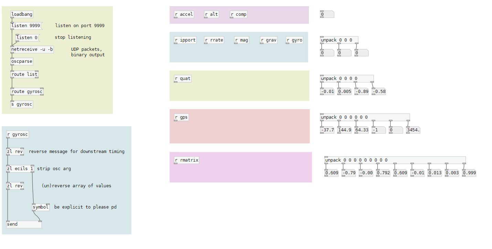

---
title: "gyrosc 2 pd"
date: 2022-01-31
publish: y
tldr: "This note describes a Pure Data patch that receives OSC data from the Gyrosc iOS application and tags it with a dynamic send object for global access. It provides available receives and useful code snippets for easy patching, and mentions using Gyrosc with a DSTIKE ESP32 watch for data logging."
---

[Download gyrosc2pd.pd](../files/gyrosc2pd.pd)

This patch receives OSC data from [gyrosc](https://www.bitshapesoftware.com/instruments/gyrosc/) , and tags them with a dynamic send object to be accessed globally via named receive objects.   Available receives are shown on the right, and useful code snippets are provided for easy patching.

The default port is 9999.

Gyrosc is a very capable iOS application and can be [configured using a .CSV file](http://www.bitshapesoftware.com/instruments/gyrosc/configuration.html).  I use the application in tandem with an [PacketPunk - OSC logging on the DSTIKE ESP32 watch](PacketPunk%20-%20OSC%20logging%20on%20the%20DSTIKE%20ESP32%20watch.md) for logging data in the field.
