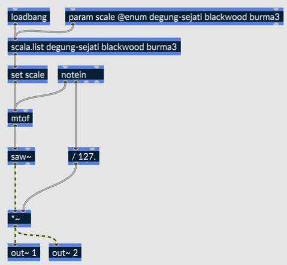
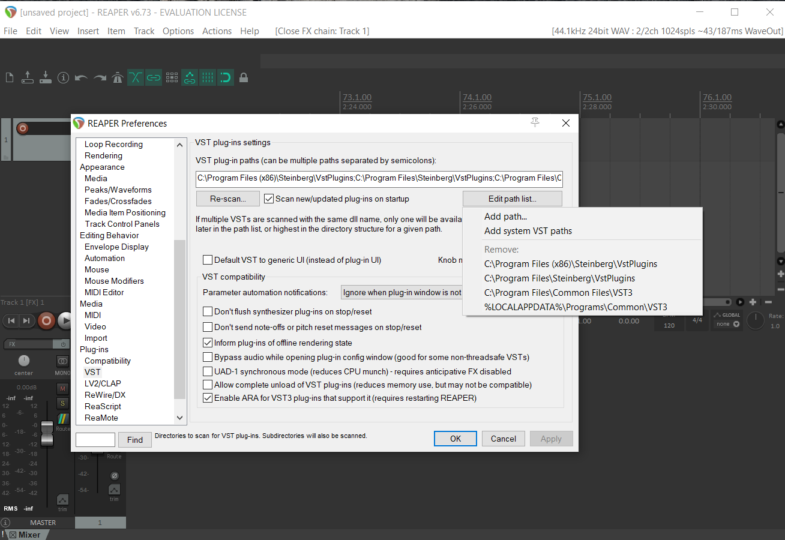

---
# ZEAL CO NOTE ---
publish: y

# Required ---
title: "Making a plugin with RNBO"
date: 2023-02-03

# Optional ---
summary: "how to cram Max into anything"
tldr: "This note outlines how to export RNBO patches as VST3 plugins for various operating systems and host them in different environments. It covers creating simple effect and instrument plugins, building them in Max, creating presets, exporting as VST3, and providing hosting examples for MuseScore 4, Pure Data, Bespoke Synth, and Reaper."

# Notes ---
# Images and links to files require:
# - standard markdown
# - relative paths  
# - no spaces
---



We're going to look at using RNBO to export a plugin we can use in our other tools.  RNBO patches can be exported as VST3 for Windows, OSX, and Linux, covering the vast majority of tools and operating systems ( and RNBO's JavaScript export can help us target those pesky mobile devices ). 

We will look at exporting both effects and instruments as VST3 plugins.

We'll then look at running them on an assortment of hosts.  You should experiment with opening them in the weirdest VST3 or AU compatible host you use.


##  [Download rnbo-workshop-mess-23.maxpat](../files/rnbo-workshop-mess-23.maxpat)


# Resources
- A reference write-up and video about [exporting VSTs with RNBO](https://rnbo.cycling74.com/learn/using-the-vst-audiounit-target)
- The [RNBO explore page](https://rnbo.cycling74.com/explore)  has example patches for a variety of contexts and use cases.
- About [creating presets using Max snapshots](https://rnbo.cycling74.com/learn/presets-with-snapshots).

# Requirements
- A Mac or Windows machine.
- with [Max](https://cycling74.com/) and [RNBO](https://cycling74.com/products/rnbo) installed.
- and at least one VST3 host such as [Reaper](https://www.reaper.fm). 
- An internet connection for compiling the plug-ins.

<!---
# Questions
- What is your previous Max experience?
- What is your previous audio development experience?
- What tools do you use in your practice?
--->

# Creating a Simple Effect Plugin
## Building the Plugin
- Open Max
- Using the package manager, install **RNBO Guitar Pedals** and **RNBO Synth Building Blocks**
- Create a new patcher
- create a \[rnbo~\] object
- Copy the internals from one of the guitar pedal effects into your RNBO patcher
- Drag a file from the audio section of the left side bar and connect it to your \[rnbo~\] object
- Add a \[live.gain~\] and an \[ezdac\] to the output of your \[rnbo\]
- In you Max patcher, add \[attrui\] objects for each parameter of your effect
- Save your Max patch (so snapshots work).

## Creating Presets
- Play with the parameters in the \[attrui\] objects
- Select the \[rnbo~] object  and click the snapshot button on the right side bar.
- Make sure it says "rnbo~ snapshots" at the top of the Snapshots sidebar.

## Exporting as a VST3
- From your RNBO patcher, open the Export Sidebar on the right side of the window.
- Choose Audio Plugin Export.
- Set "Format and Platform" to your requirements.
- Give your plugin a name, manufacturer, and manufacturer code as desired.
- Set plugin type to Effect
- Choose an output directory - it can be useful to create a directory specifically for your exported plugin.
- Enable "Include Presets"
- Click "Export to Selected Targets".

# Creating a Simple Microtonal Instrument
## Building the Instrument
The patch below uses the scala feature of RNBO to implement microtonal tuning systems.


- Choose a few scales from the [Scala scales directory](https://www.huygens-fokker.org/docs/scalesdir.txt) and add them as arguments to the \[scala.list\] object, and to the @enum argument of \[param scale\] object. 
- Set the @polyphony argument of the enclosing \[rnbo~\] object to hear the microtonal intervals.

# Hosting Examples
## [MuseScore 4](https://musescore.org)
MuseScore 4 looks for VST3 files in the following places:
```
# windows:
C:\Program Files\Common Files\VST3

# mac and linux:
~/.vst3/
/usr/lib/vst3/  
/usr/local/lib/vst3/
```

You can set a custom folder location in *preferences > general > folders*


## [Pure Data](https://puredata.info)

Use the deken package manager to install the **vstplugin~** external.  open deken by clicking help > find externals, then search for `vstplugin~`, select the latest version and click install.


## [Bespoke Synth](https://www.bespokesynth.com)
Click VST plugins > manage VSTs


Then "Scan for new or updated VST3 plug-ins"


Add your folder and click scan.


## [Reaper](https://www.reaper.fm/)
- Click Options > Preferences > VST
- Clicking *Edit path list* will reveal the currently scanned folders.

- Add you VST folder to the path list
- click Re-scan > Rescan VST Paths for new/modified plug-ins
