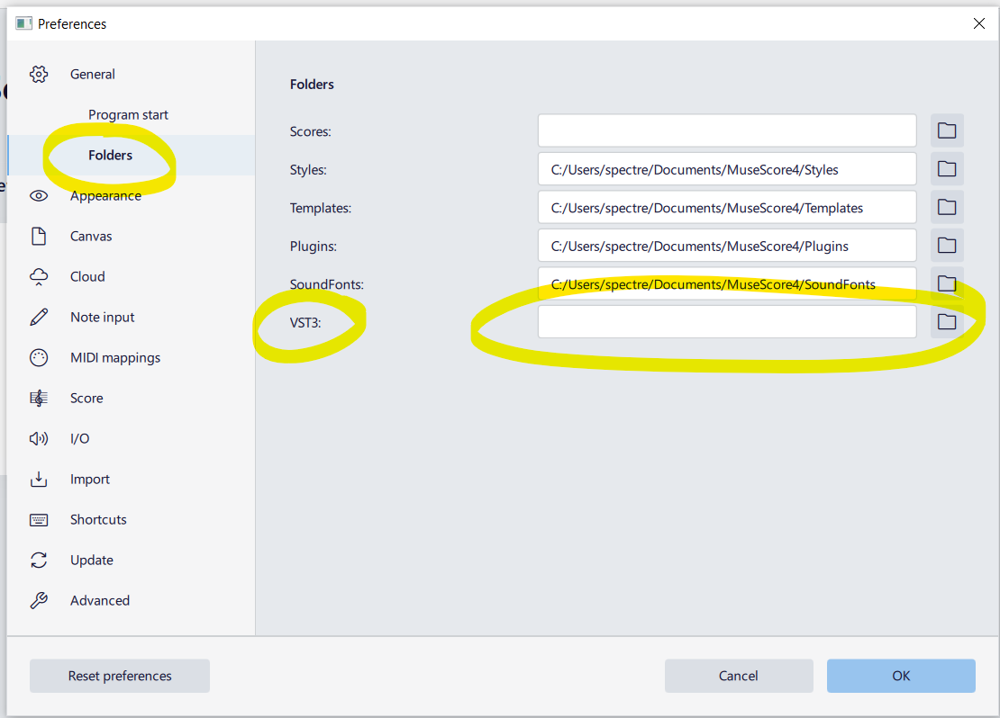
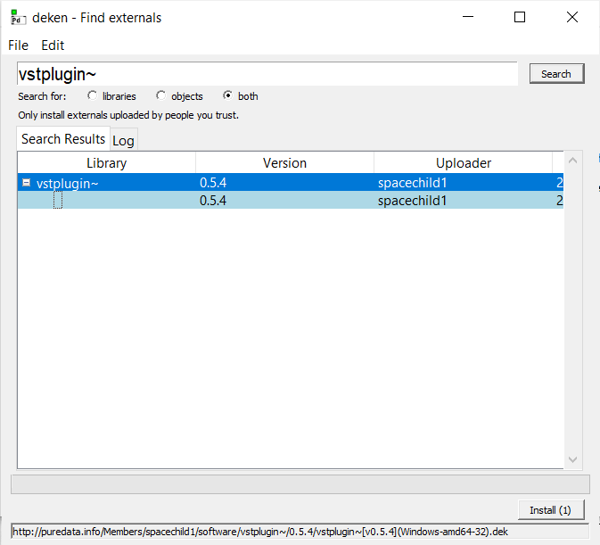
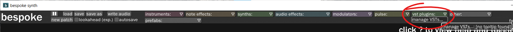
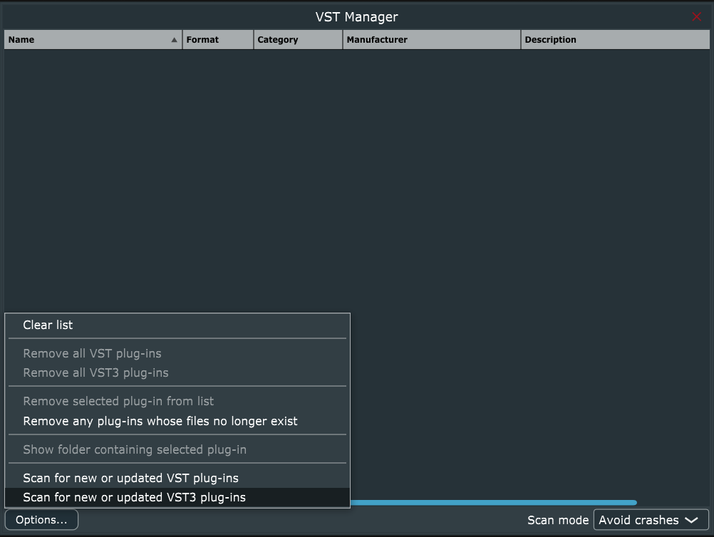
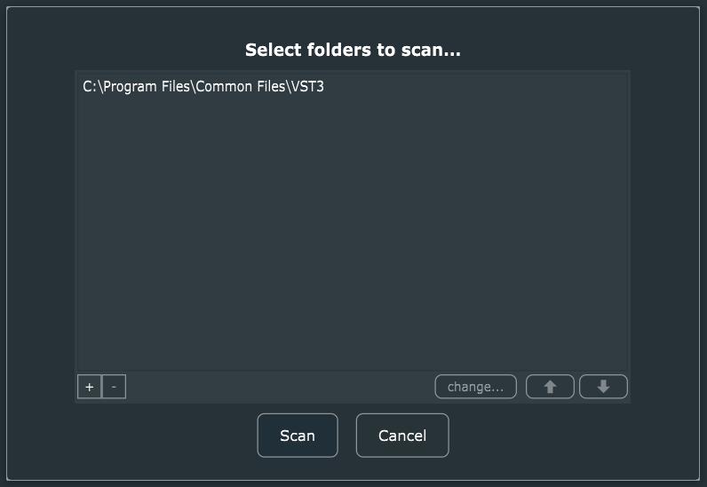

---
# ZEAL CO NOTE ---
publish: y

# Required ---
title: "Making a plugin with RNBO"
date: 2023-02-03

# Optional ---
summary: "how to cram Max into anything"

# Notes ---
# Images and links to files require:
# - standard markdown
# - relative paths  
# - no spaces
---


## reference: https://rnbo.cycling74.com/learn/using-the-vst-audiounit-target

We're going to look at using RNBO to export a plugin we can use in our other tools.  RNBO patches can be exported as VST3 for Windows, OSX, and Linux, covering the vast majority of tools and operating systems ( and RNBO's JavaScript export can help us target those pesky mobile devices ). 

We will look at exporting both effects and instruments as VST3 plugins.

We'll then look at running them on an assortment of hosts.  You should experiment with opening them in the weirdest VST3 or AU compatible host you use.

# Requirements
- A Mac or Windows machine
- with [Max](https://cycling74.com/) and [RNBO](https://cycling74.com/products/rnbo) installed
- and at least one VST3 host such as [Reaper](https://www.reaper.fm). 

<blockquote>
</blockquote>

# example rnbo patches
```
🚀 incoming 
```
# export examples
```
🚀 incoming
```
# hosting examples
```
🚀 incoming
```
<!--
## [MuseScore 4](https://musescore.org)
MuseScore 4 looks for VST3 files in the following places:
```
# windows:
C:\Program Files\Common Files\VST3

# mac and linux:
~/.vst3/
/usr/lib/vst3/  
/usr/local/lib/vst3/
```

You can set a custom folder location in *preferences > general > folders*


## [Pure Data](https://puredata.info)

Use the deken package manager to install the **vstplugin~** external.  open deken by clicking help > find externals, then search for `vstplugin~`, select the latest version and click install.



## [Bespoke Synth](https://www.bespokesynth.com)
Click VST plugins > manage VSTs



Then "Scan for new or updated VST3 plug-ins"



Add your folder and click scan.



## [Reaper](https://www.reaper.fm/)
-->