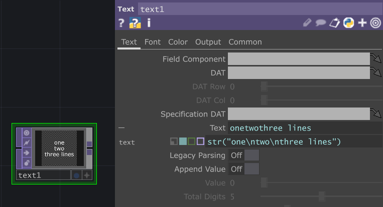

# Animating text with the geotext COMP



The geotext comp allows for fine granularity 3D text animation.

💾💾💾💾💾💾💾
## 💾[DOWNLOAD ../files/text-paths.5.toe](../files/text-paths.5.toe)  
💾💾💾💾💾💾💾

# More
The COMP would pair well with optical flow tracking to create flowing, responsive words or characters.  A higher level approach to the same idea below.

  


<!-- vector fields: https://www.youtube.com/watch?v=7oYBTF_9DHg -->

For very simple text manipulation, the `str()` function can be used to insert whitespace and other escaped characters into the text field of the Text TOP.

# Related
- [an introduction to interactive audio-vision](an%20introduction%20to%20interactive%20audio-vision.md)

