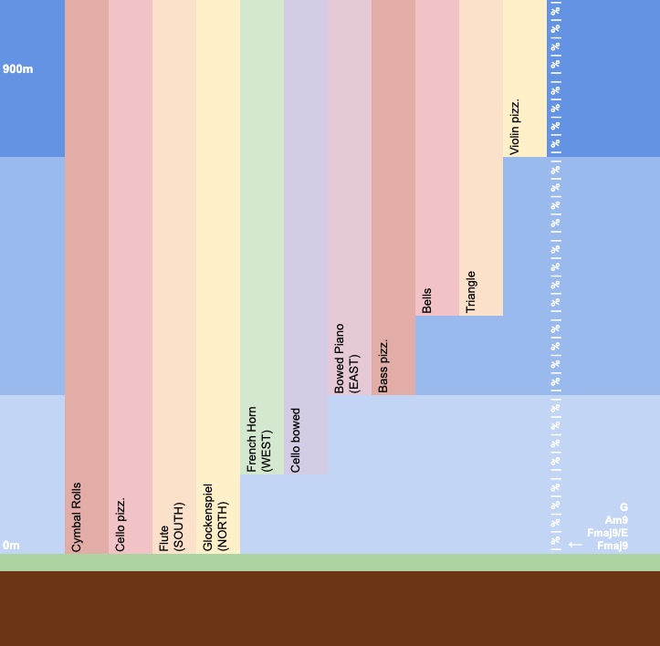
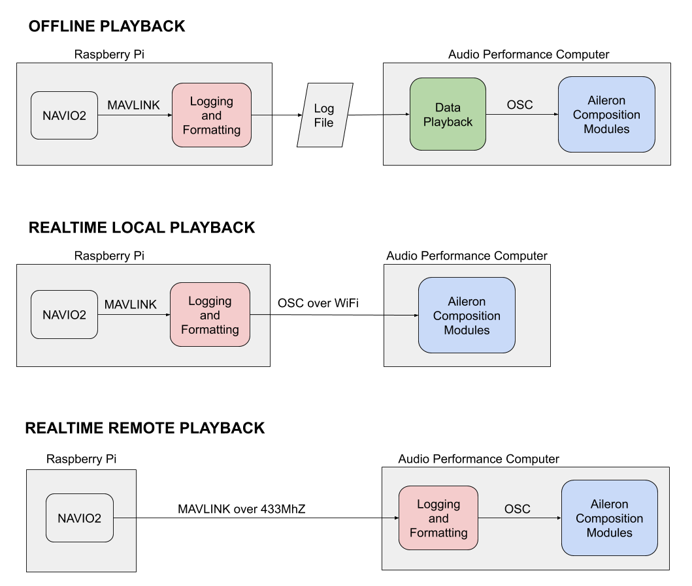



<!--  -->

Aileron One is the result of several years of research into dynamic music systems and the musical sonification of human flight.  The work explores the use of a sailplane flight path as a structure around which musical form can emerge. The work serves as a point of reflection on the composition of such spatial metacompositions and their potential for enhancing experiences and enabling new modes of artistic performance in physical, virtual and mixed realities.  Output of the project includes audiovisual artefacts, musical composition, software, research papers, and presentations.  

Altitude serves as the foundational element on which the piece AILERON ONE is built.  The piece can be considered as a vertical structure rising to approximately 900 metres above the ground.  A circular chord progression (Fmaj9 Fmaj9/E Am9 G) repeats along the up vector with instrumentation becoming denser in six, discrete, evenly spaced layers.  To add variation and movement, a set of instruments are panned to four evenly spaced compass headings.  Total velocity is then used to control the speed of melodic and percussive elements throughout the piece.

The system as a whole has three primary components - a body-worn sensing unit responsible for logging and broadcasting positional data, a telemetry playback system, and a suite of compositional modules built in Max for Live.  The positional sensing unit consists of an Ardupilot-based flight controller and Raspberry Pi computer.  The Raspberry Pi communicates with the Ardupilot board via the Mavlink protocol allowing for logging and broadcasting of captured sense data as Open Sound Control (OSC).  The system has been designed such that it can be used for logging data as well as communicating in real-time with the composition modules either locally over Wi-Fi or remotely via 433Mhz radio link.  The telemetry playback module was built in Max allowing for the replaying of logged telemetry alongside synchronized video recordings.  This enables the composer to create a spatial metacomposition "offline" for later use in a real-time performance context.



# Learn more...
- [Research paper: "Composing in Spacetime with Rainbows"](./assets/Composing%20in%20Spacetime%20with%20Rainbows.pdf)  
- [Tracy Redhead's research into Dynamic Music](https://computermusic.org.au/proceedings/ACMC2018-proceedings/09Redhead.pdf)  
- [Aileron Max for Live modules](https://github.com/zealtv/Aileron)