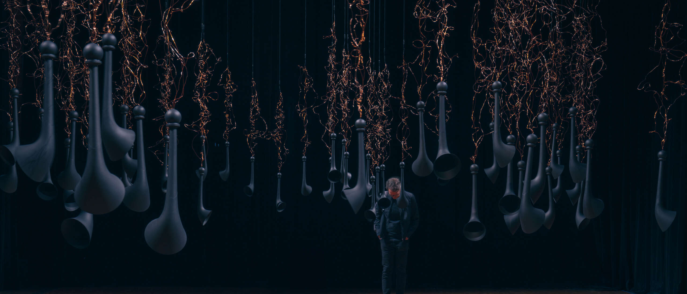

Belief System is a scalable work suited to site specific interiors as well as black and white boxes.  For presentation existing content is replaced or augmented with local content (including multilingual content} and visitors to the installation can also share their Beliefs to become part of the system.

  
 
  
  

Accompanying this aurally and visually immersive space is a book where the flocks of beliefs are transcribed allowing the visitor to connect in alternate way.

Created by Anna Tregloan & Adriano Cortese  
Bob Jarvis, Composition/Programming  
Govin Ruben, Production Manager/Lighting  
Oliver Bown, Sam Ferguson, Ella Mannor and Kurt Mikolajczyk, Software and hardware development (UNSW Interactive Media Lab and UTS Creativity and Cognition Studios).  
Nic Clark, Producer.  
Elliot Hughes, Trumpet.  
Transcription assistance, Meg Anderson.  