

A technical Demonstration of the [Spout](http://spout.zeal.co) realtime video sharing framework. 

Teaming up with Kiwi media artist Oliver Ellmers, we’ve started up a new experiential design company Blunk.  Our goal with Blunk is to use emerging technologies to create previously impossible experiences and one of our first pieces is a technical demonstration of the new Spout video sharing framework for windows.  Channels is a made-for-vimeo interactive installation built around a lovely old TV I found on the side of the road.  Six “channels” are created, each having a video output produced in a different realtime graphics framework as well as a colour palette.  The user is able to select different channels using a USB remote control which will then switch the TV to a new source as well as control the projections rotating around the TV.

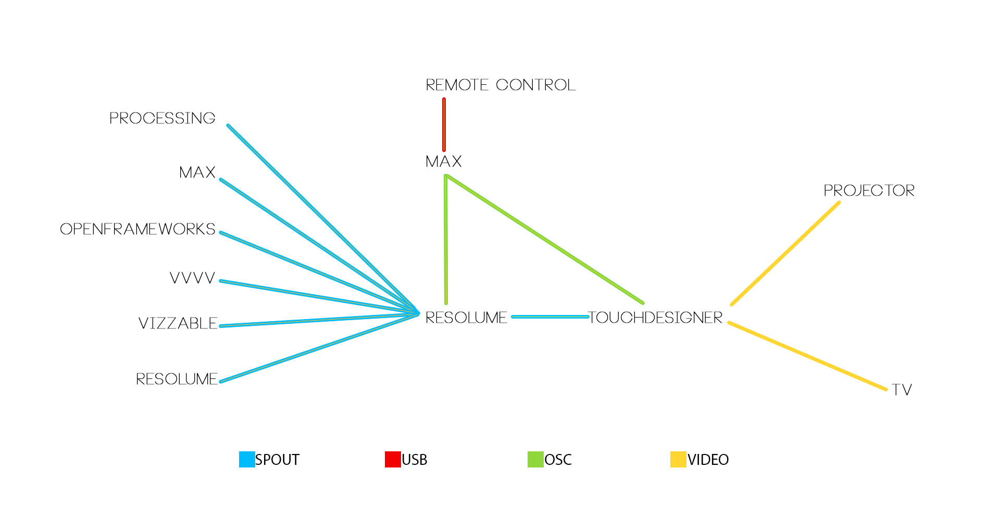

Resolume served as the hub for the system.  Five sources were spouted in to Resolume: Processing, Max, OpenFrameworks, VVVV and VIZZable.  A video file was used to represent Resolume.

Max was used to interpret keystrokes from a wireless USB remote which were then converted to OSC and forwarded to both TouchDesigner and Resolume.  In Resolume, the OSC messages were used to switch between Spout senders and in TouchDesigner the same OSC messages were used to control the graphics being projected on to the ground around the TV and to apply transition effects to the source video.  As there is currently no native Spout support for TouchDesigner, we used SpoutCam to bring the source video in from Resolume using the video in TOP.  Finally, two video streams were sent from TouchDesigner,  one to the projector and one to the TV via a scan converter and RF modulator.

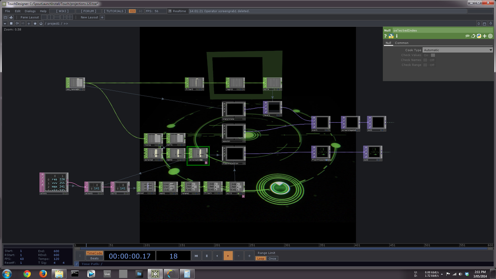
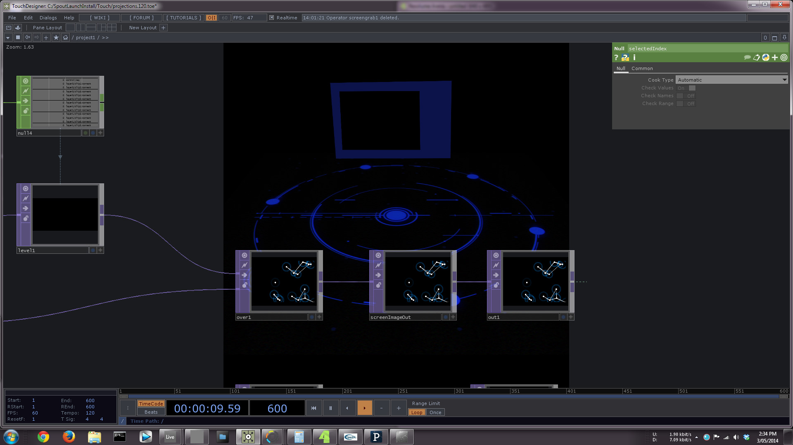
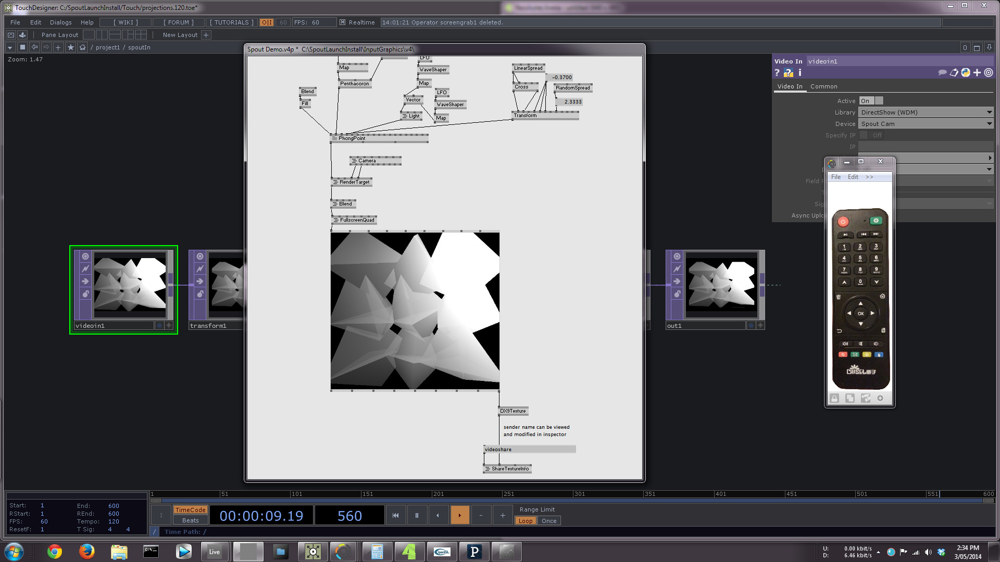
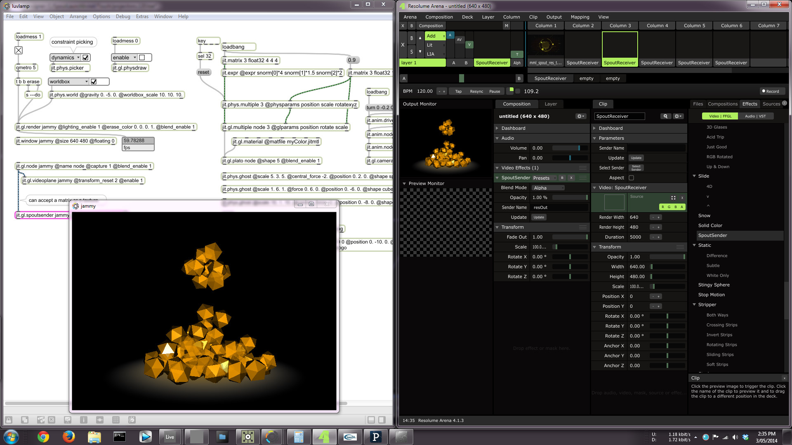
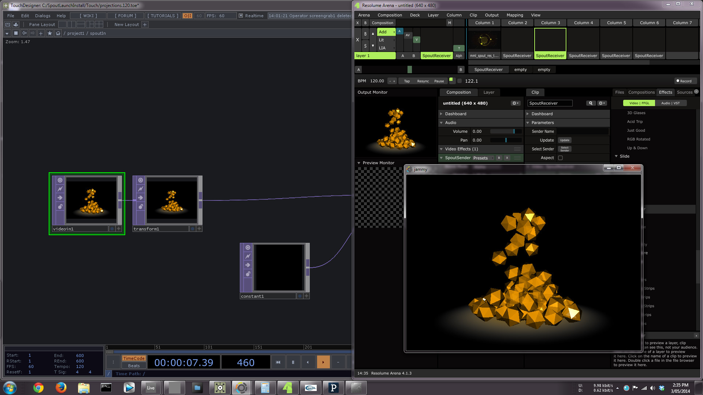
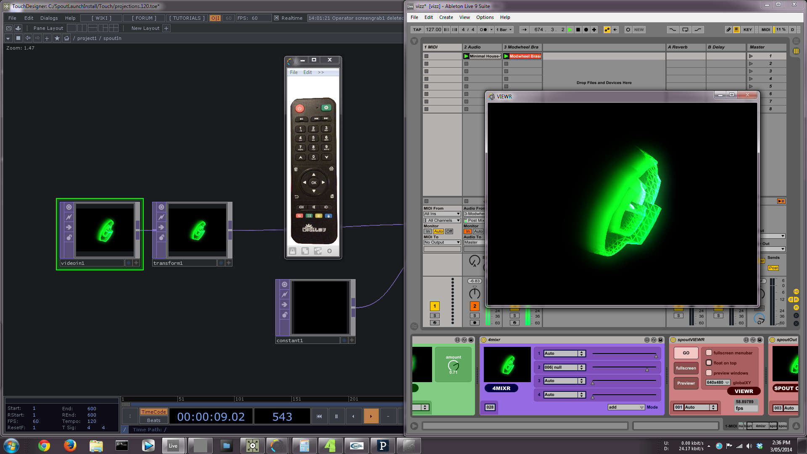
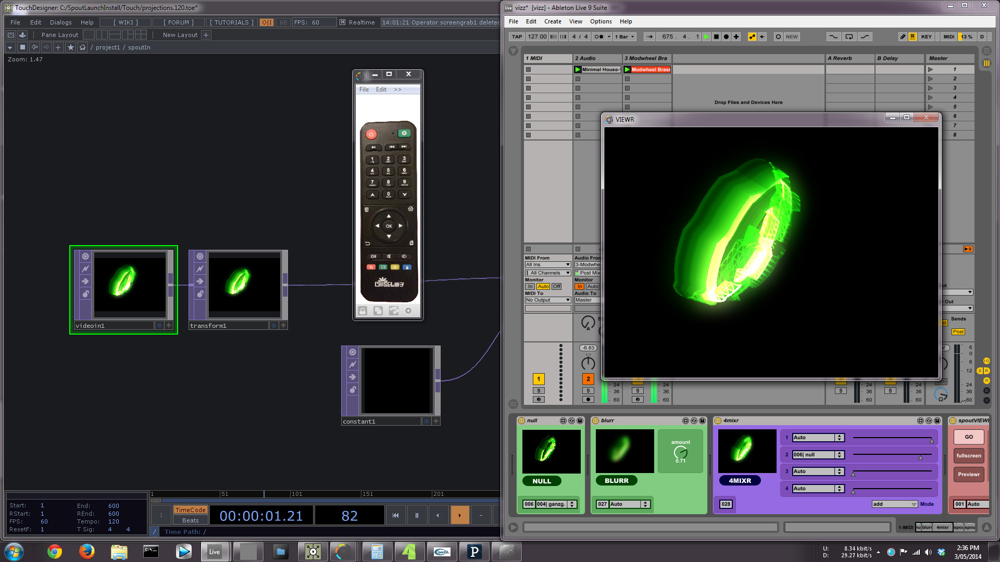
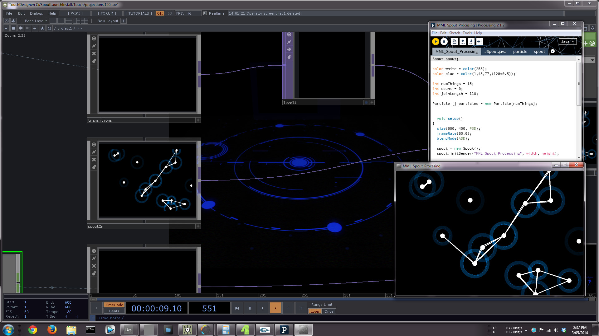
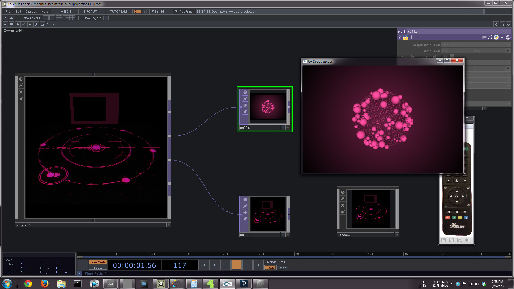
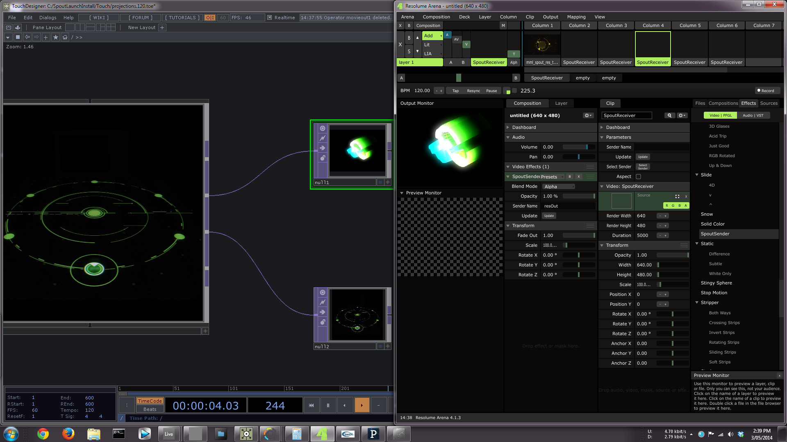

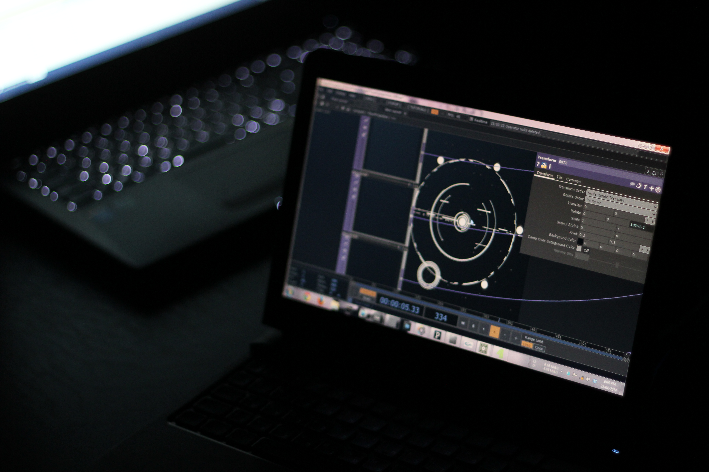
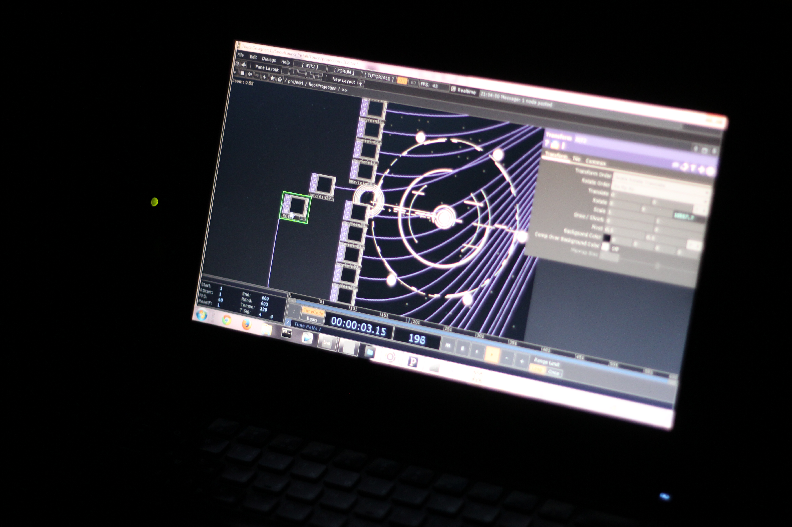
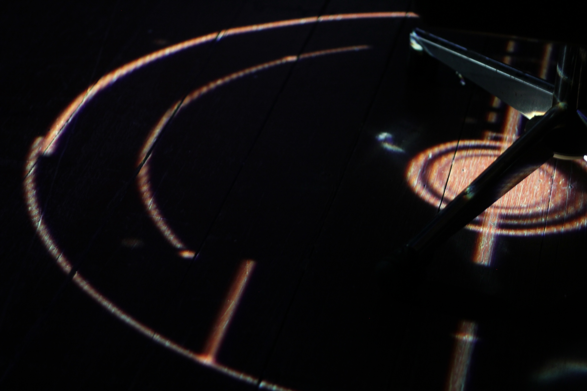
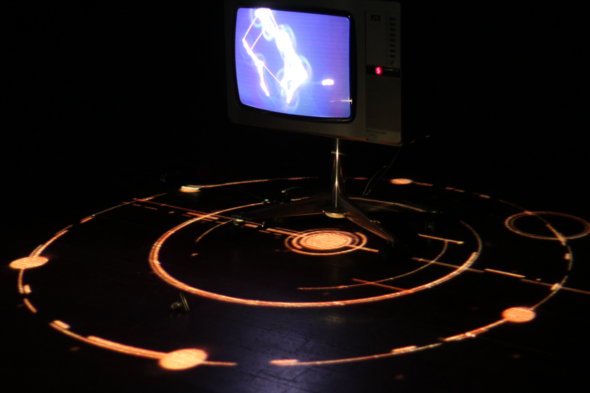

We shot the video at Melbourne Medialab and the shoot ran for about 5 hours.  Happily, there were no crashes, no stumbles and everything purred happily with all 8 applications passing video between themselves and with Windows deciding to update unannounced in the background.  Many thanks to [Melbourne Medialab](http://www.medialabmelbourne.com.au) and [Super Team](http://www.superteam.net.au/) for their support.