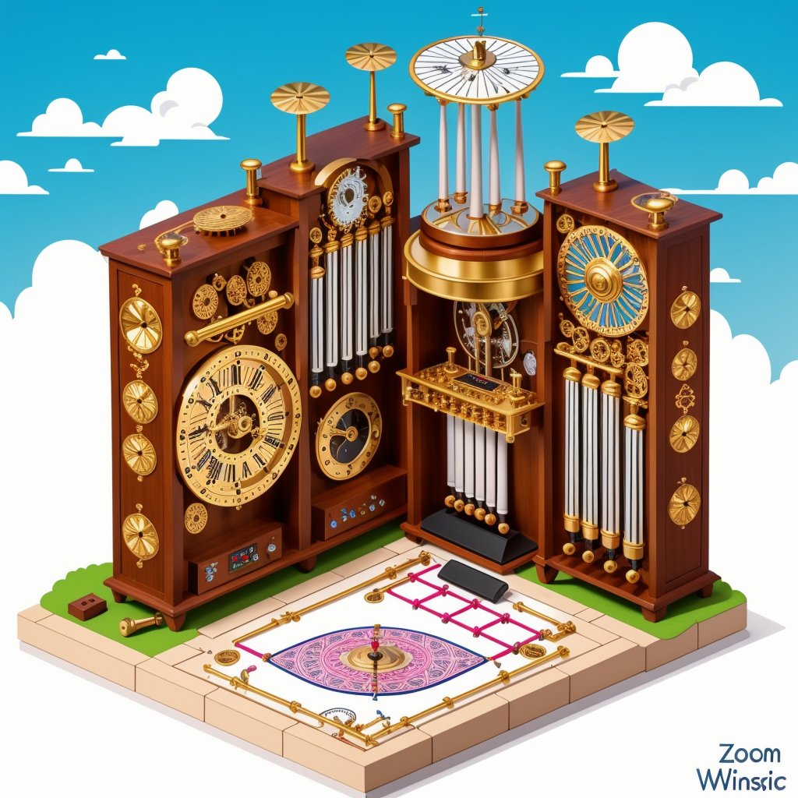
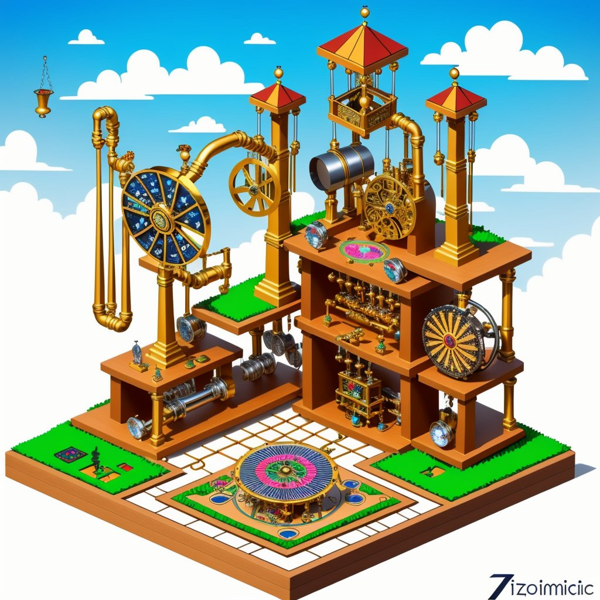
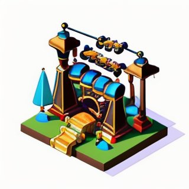
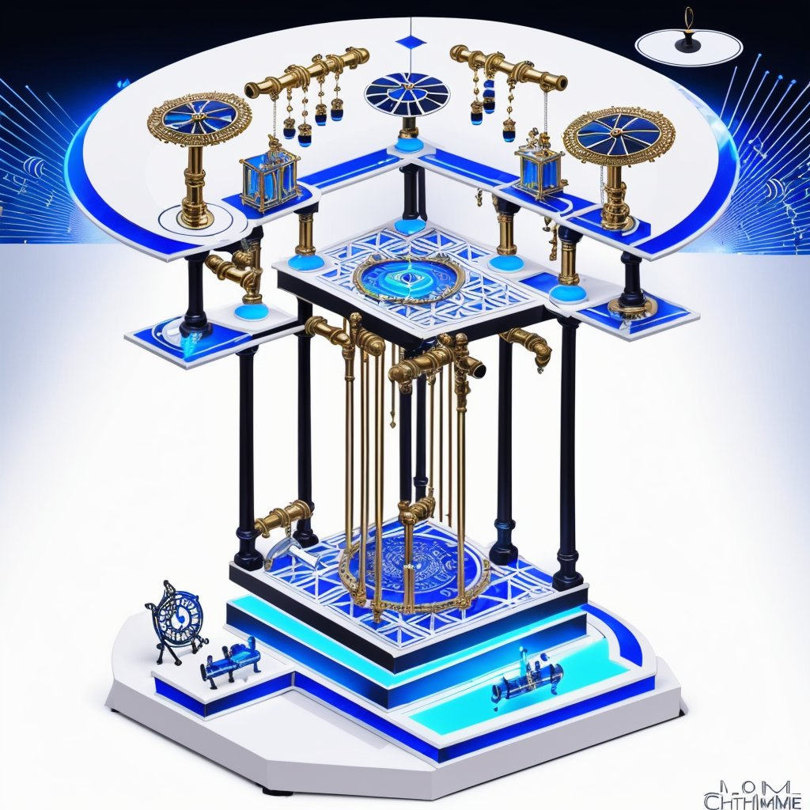
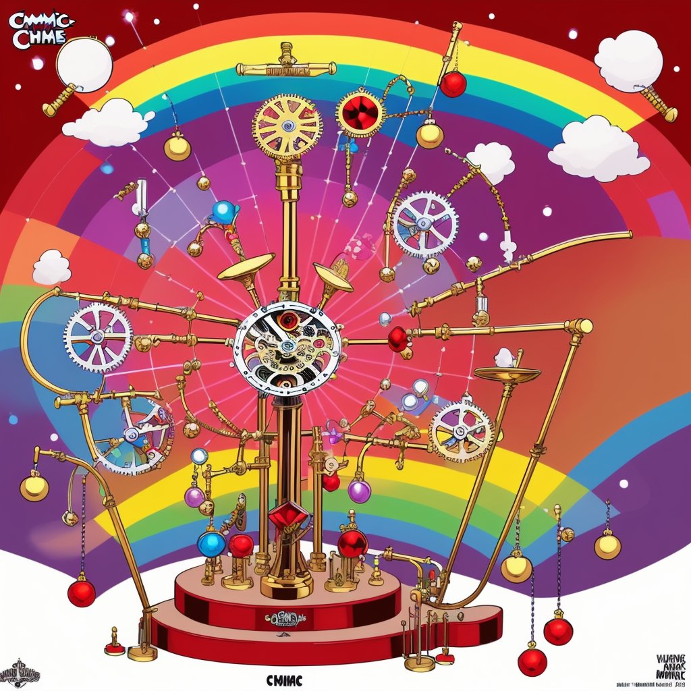
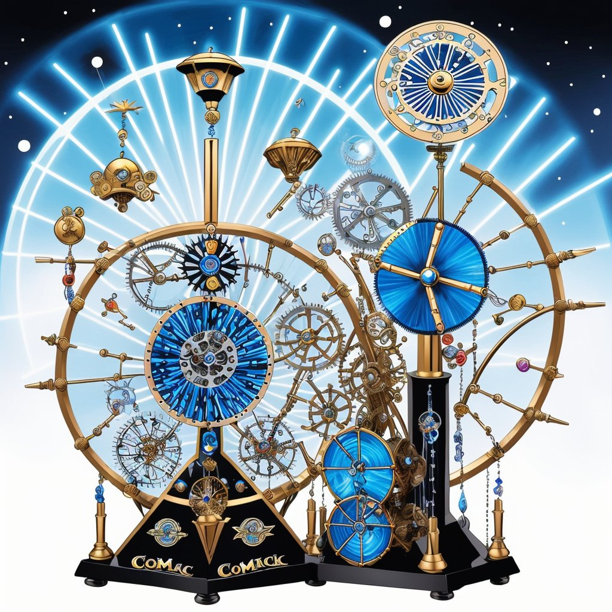
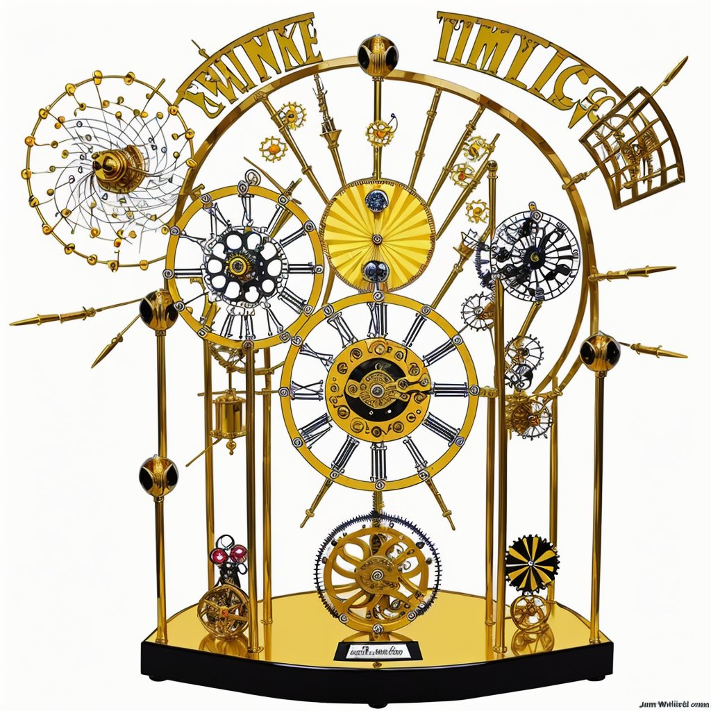
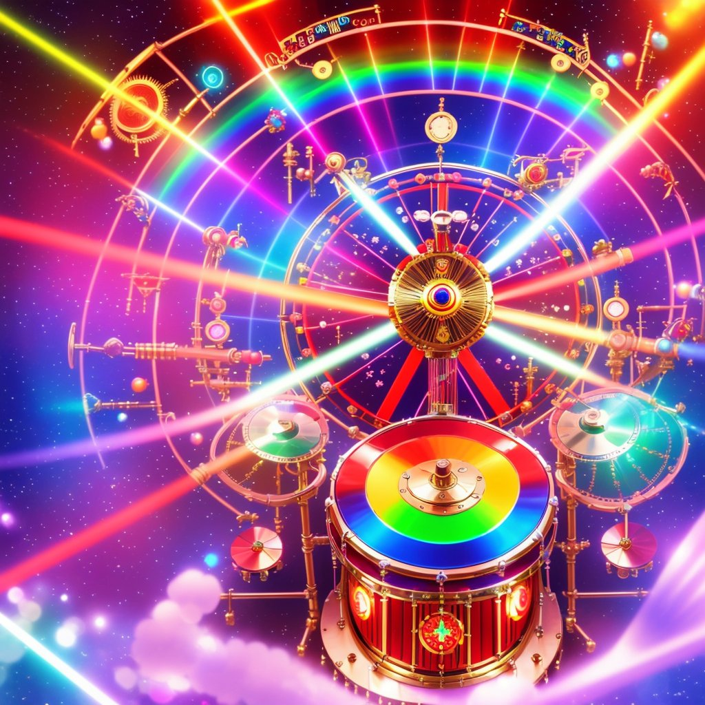

Clocks is a set of AI image-generation explorations of imaginary clockwork music machines, generated in 2024. Clocks preceded Photosynthesis — both are part of the same subconscious creative attractor. The renders wander through a few illustration styles — isometric, comic, and anime.

