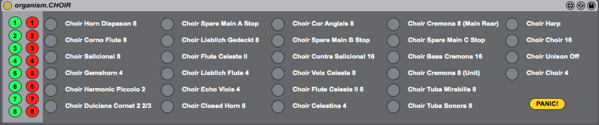
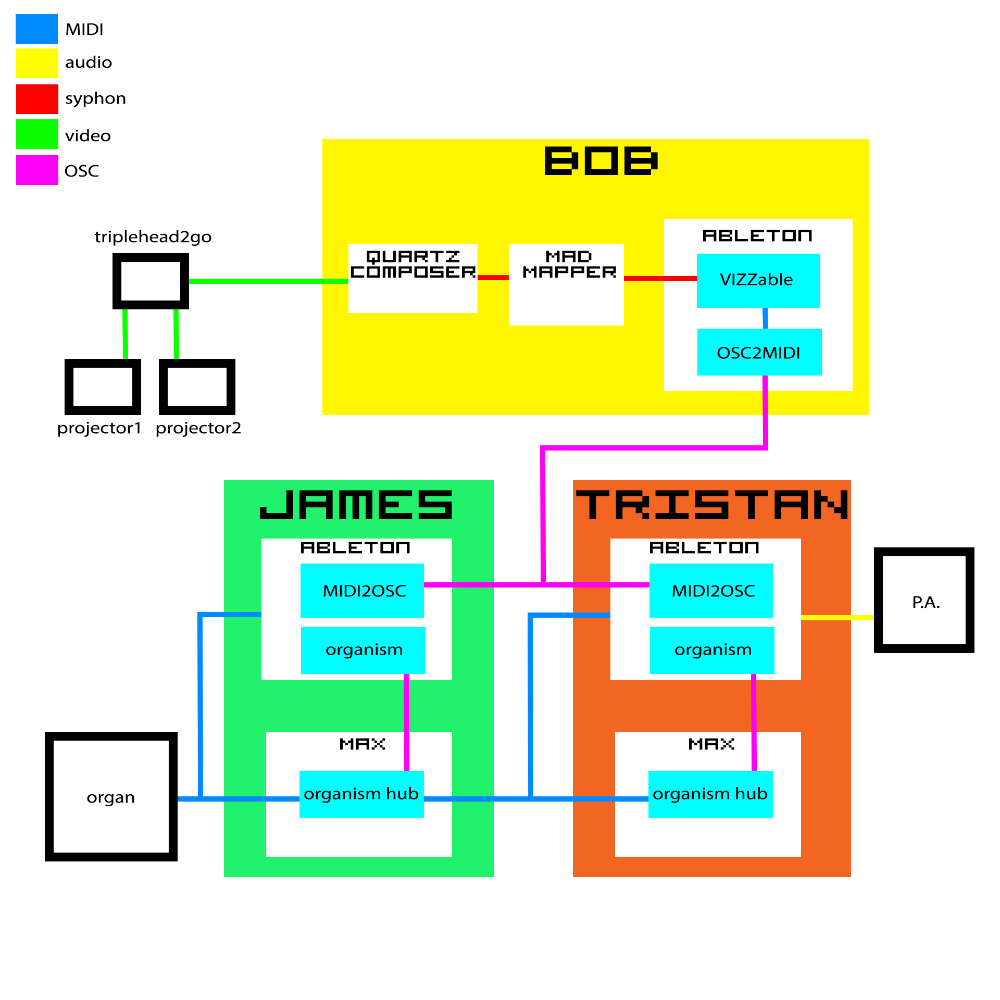



For several months throughout 2013 [Virtual Proximity](http://virtual-proximity.com) AKA [James Annelsey](http://jamesannesley.com/), Tristan Courtney and I would hang out in the Melbourne Town Hall devising new ways of using computers to pump vast amounts of air through 3-storey high steel pipes.  My particular role in all of this was to find a convenient way for the two others to send sysex (the nerdiest of MIDI commands) to the organ via Ableton Live.  This is not something Live usually likes to do and, compounding the issue, building sized MIDI controlled instruments can be temperamental.

The Melbourne Town Hall Organ is the largest instrument in the southern hemisphere with almost 8 thousand pipes plus bells and drums.  The instrument is retrofitted with a MIDI system by SSOS.  This system can send and receive note information on separate channels for each manual as well as CCs for controlling swell.  The stops are opened and closed using sysex messages which is the complicating factor when working from within Live.  The system I ended up devising was a combination of Max for Live devices recreating the stops of each manual which would send sysex messages over to a separate Max patch via UDP/OSC. This patch would then forward the messages to the instrument.  In this way we were able to step around Live’s sysex limitations.

The biggest hurdle we had to overcome was with the organ getting stuck notes.  The organ would stick on a particular note and we’d need to turn it off and on to get it going again, a process that took five to ten minutes.  This turned out to be caused by flooding the organ with too many sysex messages in too short a time.  By cueing the messages and then emptying the list at a steady rate we were able to open and close stops reliably.

The end result of all of this coercing of old and new technology was a 40 minute improvised audio-visual set intended to bemuse and perplex.

