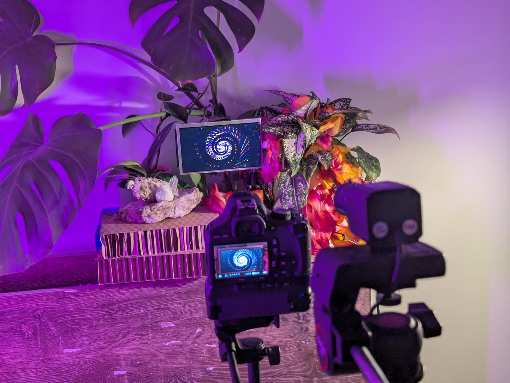
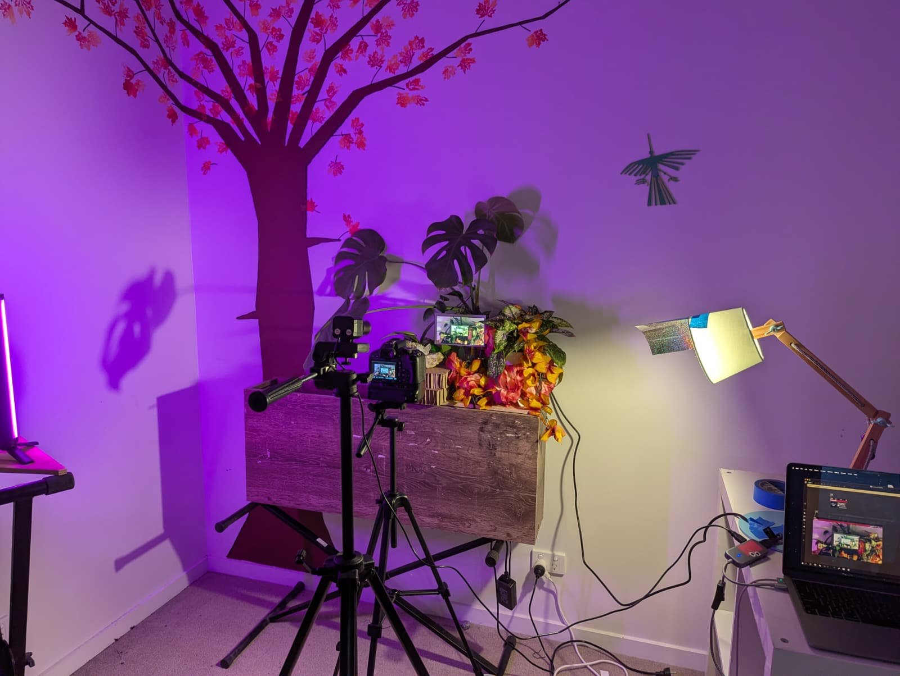
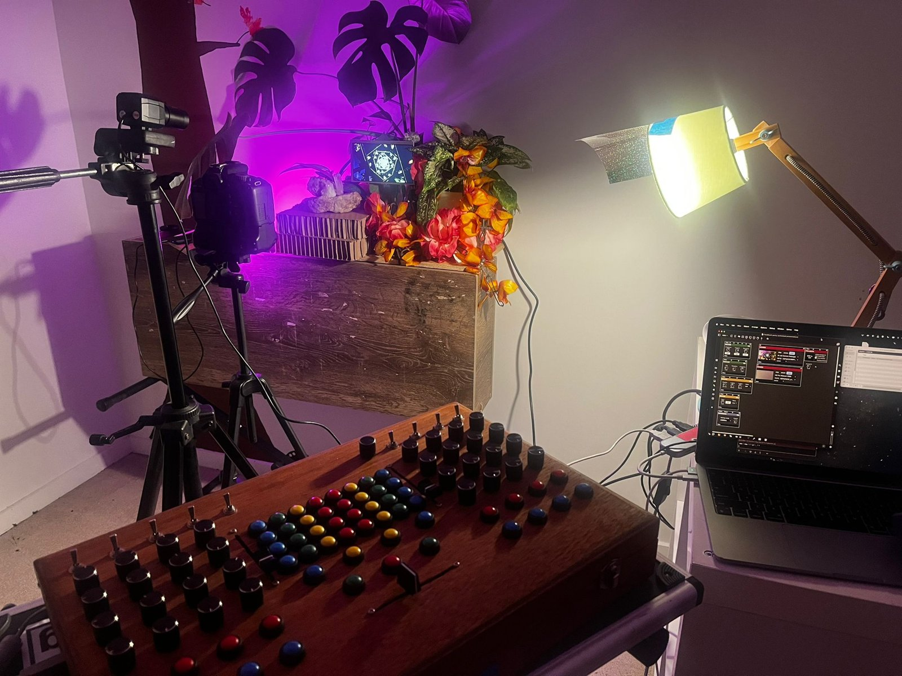



*Driftwood — Restless Earth*

Video by Bob Jarvis.

Driftwood is Nick Ashwood (pump organ, guitars, electronics) and Aviva Endean (pump organ, clarinets, electronics). "Restless Earth" appears on their album *Maps*, released by Room40 on 12 June 2026.

[Maps — Driftwood on Bandcamp](https://room40.bandcamp.com/album/maps)

