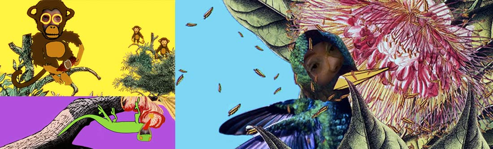



Interactive exhibition installation for The Royal Botanic Gardens, Sydney.

Programming by Robert Jarvis  
Animation by [Jean Poole](http://skynoise.net)  
Sound by [D.A. Calf](http://dacalf.com)  
Project produced by Luke Dearnley and Sophie Daniel.