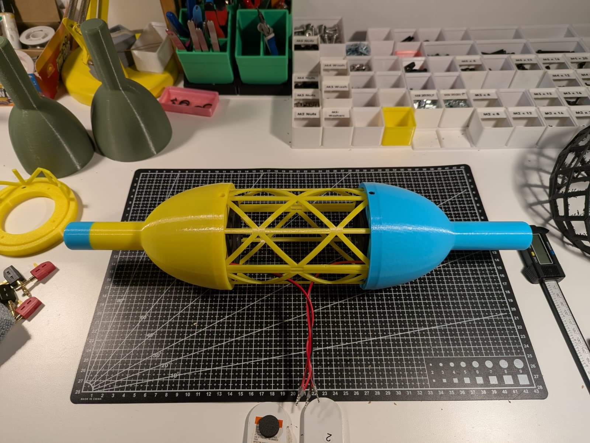
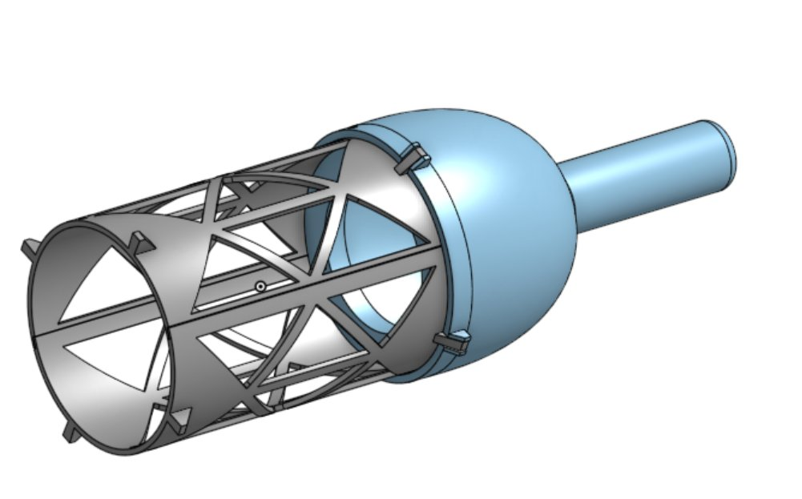
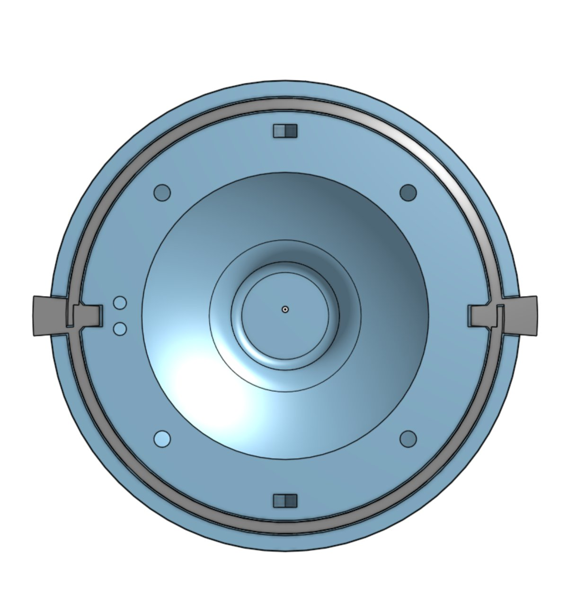
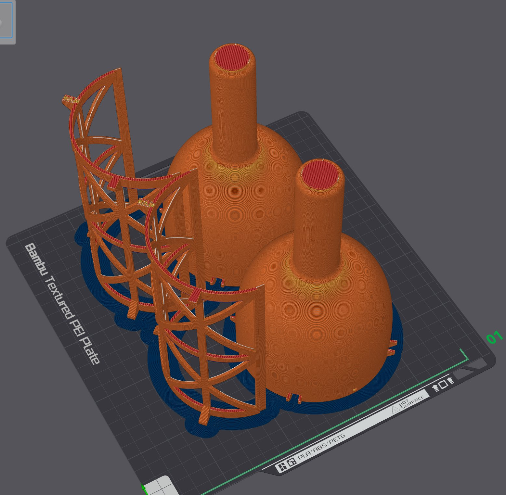

Hundreds of kites carry the singing voices of children from around the world — lifted by wind, shaped by play, offered to the sky.

Kite Choir is a participatory artwork by Cubbyhouse Co. in association with Playable Streets, world premiering in 2027. People everywhere are invited to contribute sung notes and sound effects through the participation portal — no accounts, no barriers.

Bob's role spans the participation web portal and the design of the speaker spools — handheld kite-line instruments that carry the choir into the sky.

[Take part at kitechoir.com](https://kitechoir.com)

