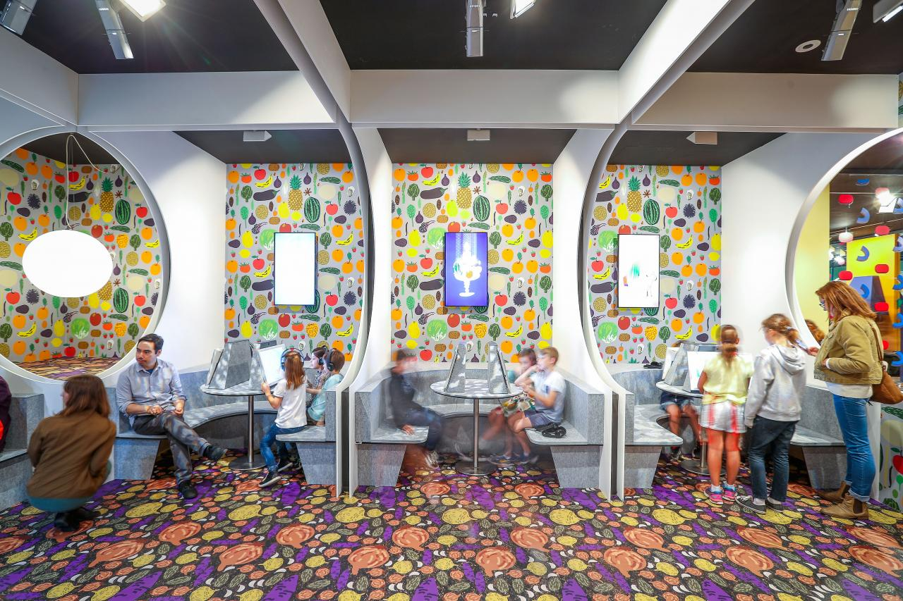
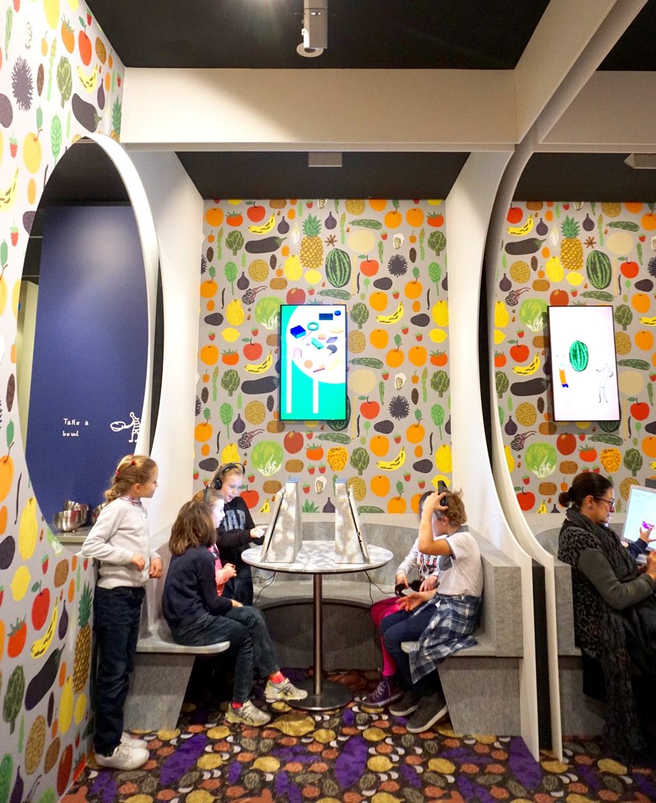
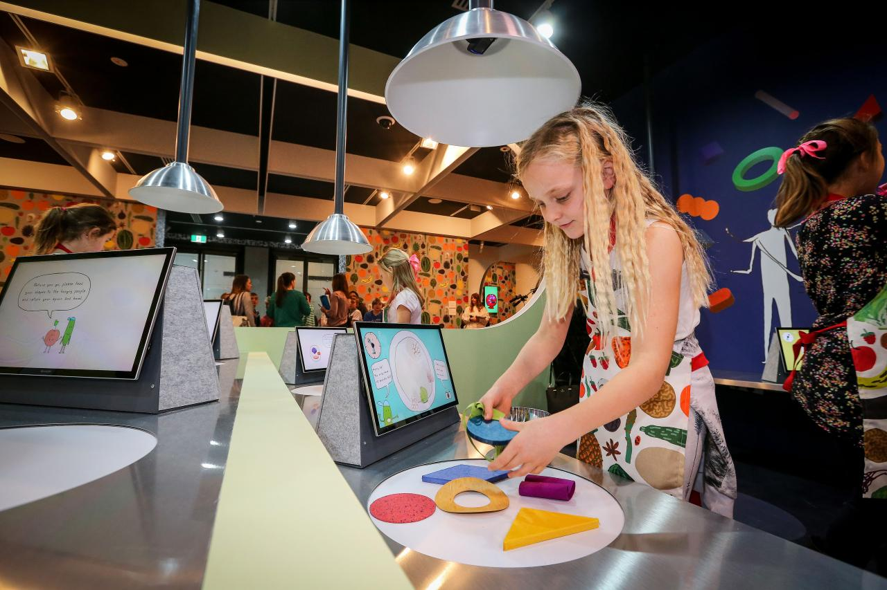
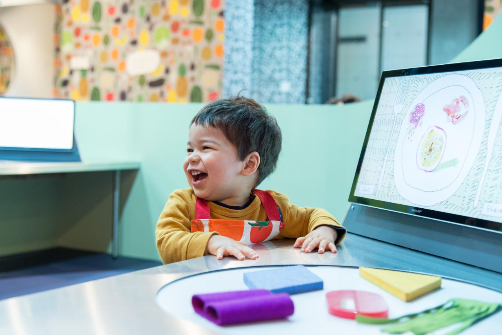
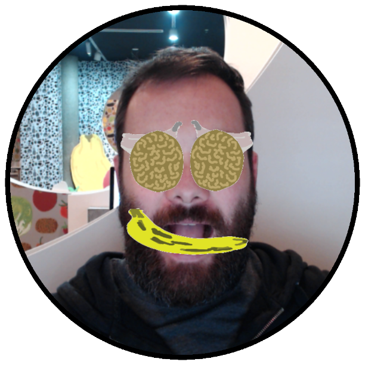
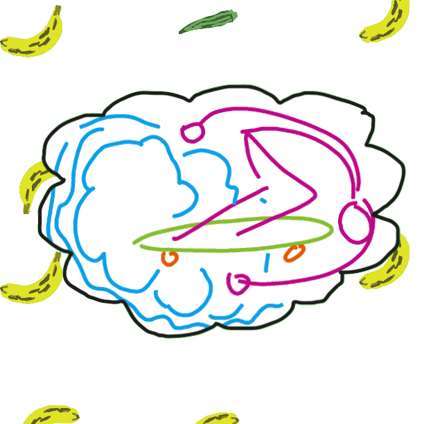
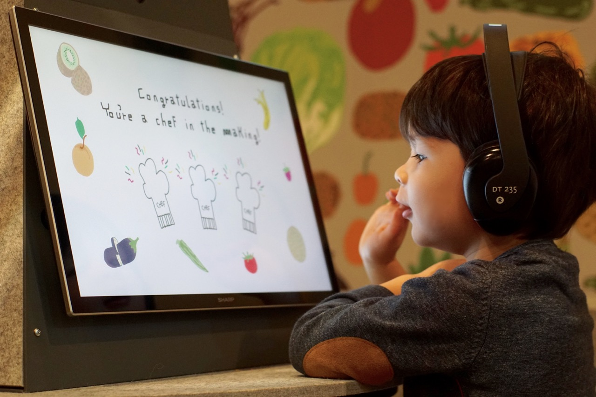

<!-- import skateGIF from './assets/skate.gif' -->

I built two interactive applications for [Marti Guixe’s](http://www.guixe.com/) Fake Food Park at [The National Gallery of Victoria](http://www.ngv.vic.gov.au/).  The first of which was a touch screen drawing application that incorporated face-tracking and animation.  Kids were lead through a series of activities including creating their own fruity face, where fruits and vegetables starting with the same letters as their name would attach to their face while they took a selfie.  They were then able to choose from a selection of drawing exercises which output sharable, animated GIFs.

The second application used colour tracking and blob tracking to take a video feed of an arrangement of abstract, colourful shapes and convert it in realtime to representations of real food.  Both applications were built with [openFrameworks](http://openframeworks.cc/), making extensive use of openCV.

<!--  -->
<!--  -->

