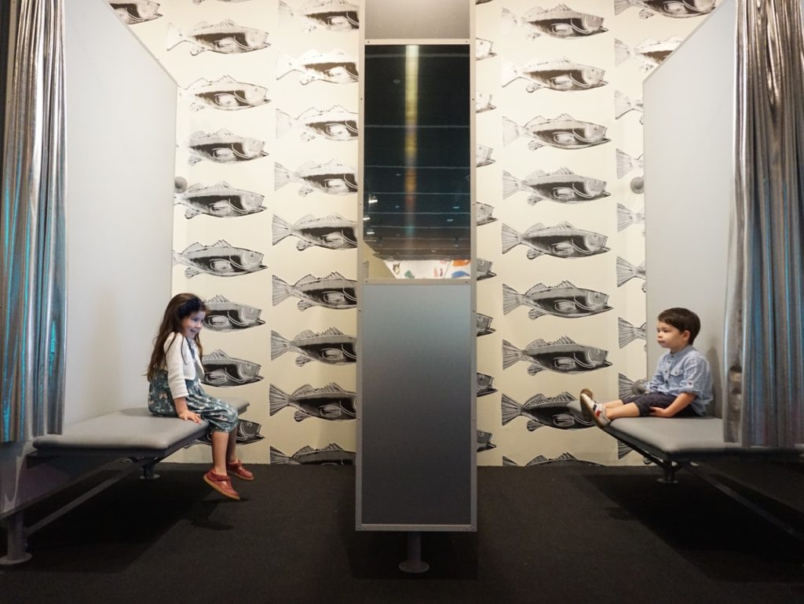
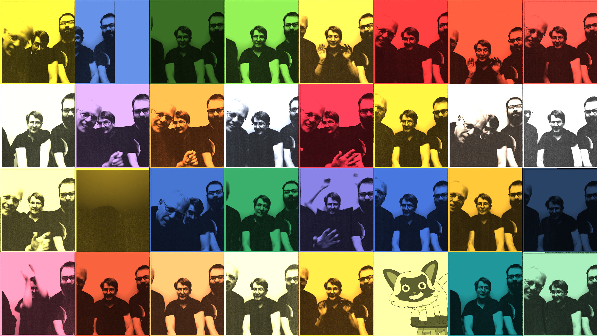
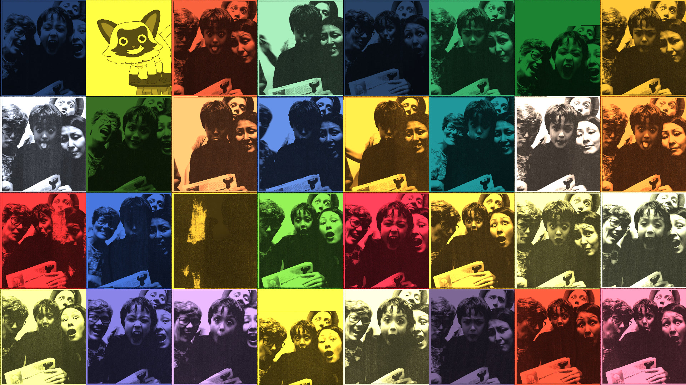
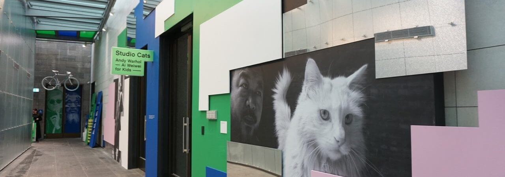



Andy Warhol’s Photobooth was an interactive installation I built for [The National Gallery of Victory](https://www.ngv.vic.gov.au/) in 2015. Participants would be guided by Sam the cat to throw a series of poses while photos were taken. The images were then processed in the style of Andy Warhol’s [Ethel Scull 36 Times](https://en.wikipedia.org/wiki/Ethel_Scull_36_Times). Participants could then share a high resolution image along with an animated video via email. Over 100,000 emails were shared through out the time of the install.

