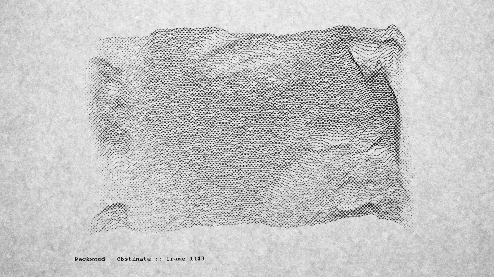
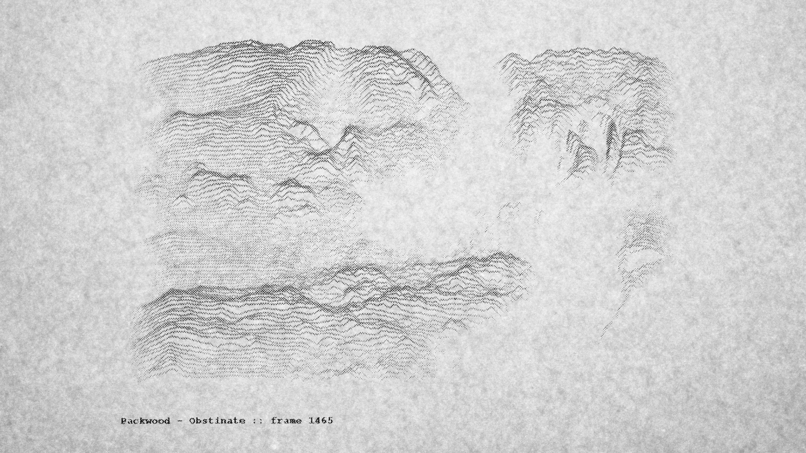
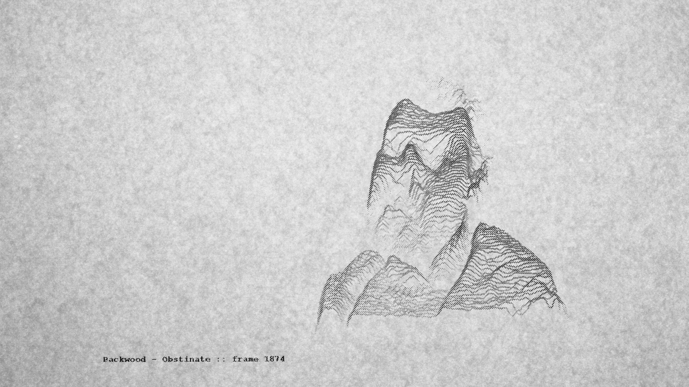
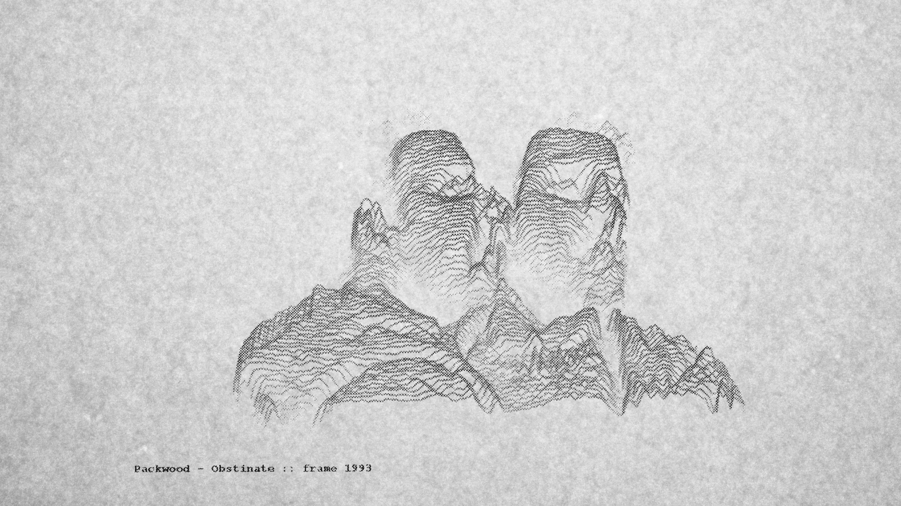
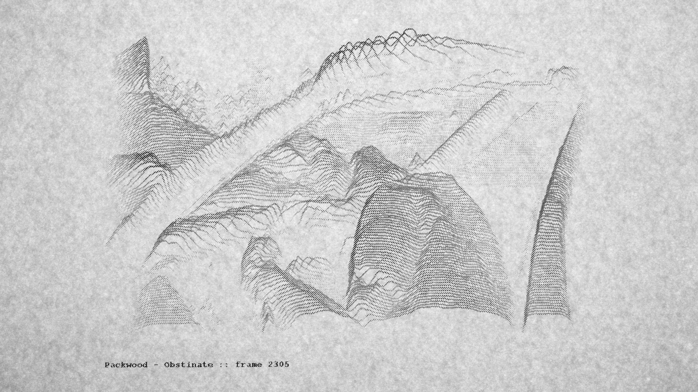
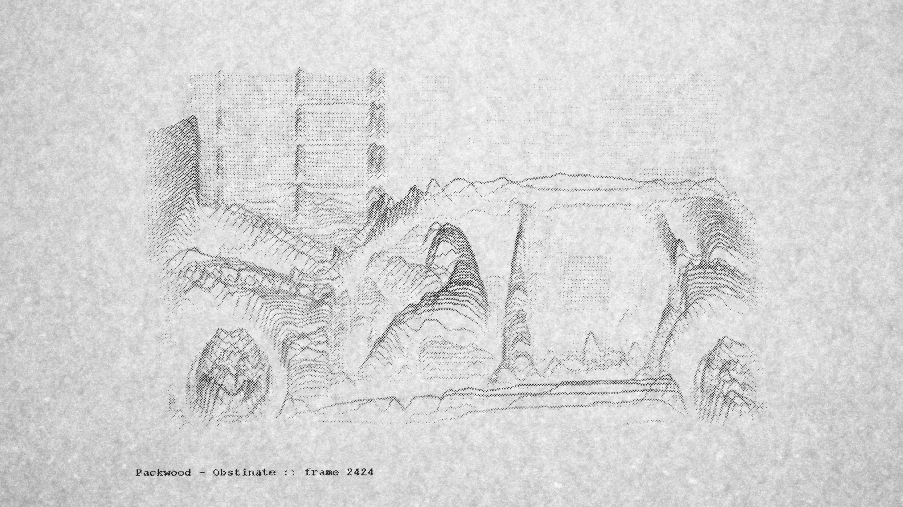
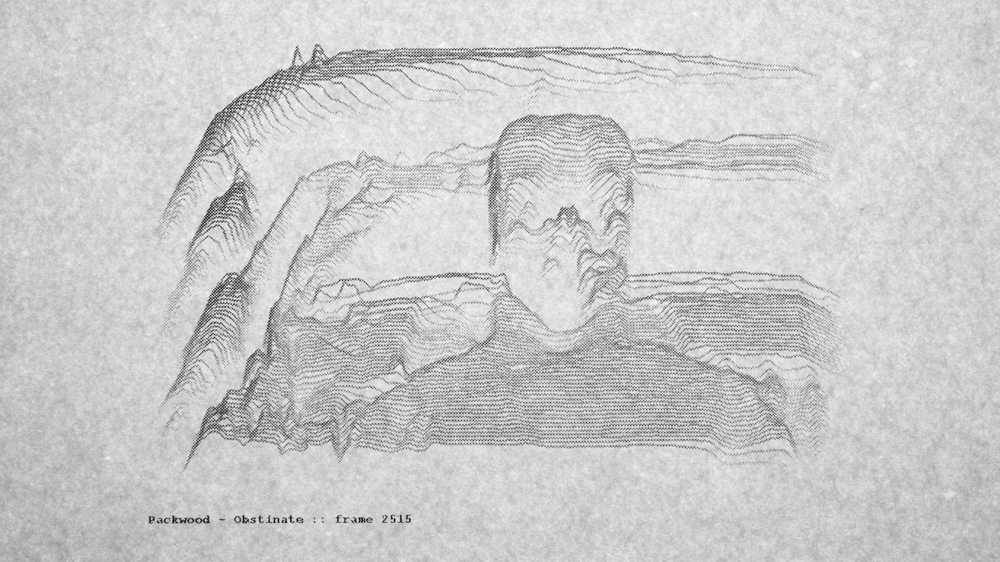



The video uses a mix of video processing, computer graphics and stop motion animation. Image processing and graphics programming was done in [openFrameworks](https://openframeworks.cc), then each of the 3500 frames were then printed out using a laser printer and recaptured on a lightbox.

openFrameworks code for the project is available [here](https://github.com/zealtv/Obstinate-Music-Video).

Documentation of the experimental animation process below:
