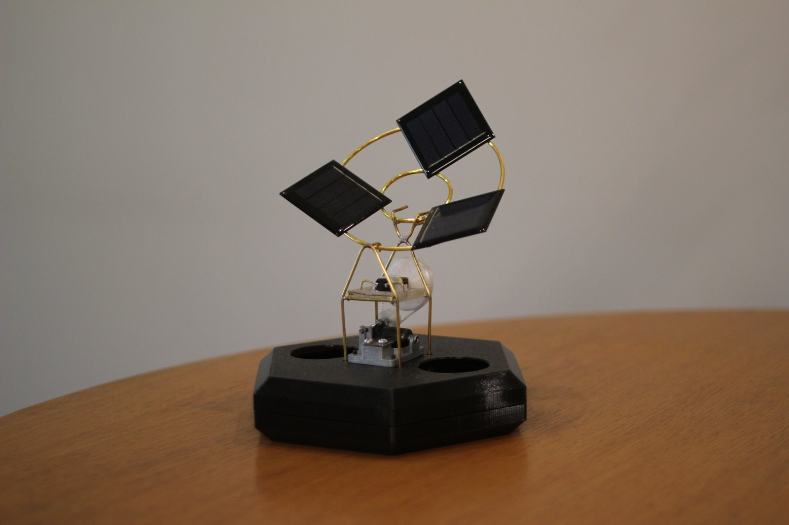



Photosynthesis is a new immersive sound installation by Bob Jarvis. This highly scalable work is powered entirely by the sun and performed by the rotation of the earth and the movement of clouds. Dozens of solar-powered electromechanical musical instruments strum gentle chords and motifs, stopping and starting as shadow and light fall on their petal-like arrangements of photovoltaic cells. What emerges are serendipitous musical moments arising from evolving atmospheric conditions and shifting planetary alignments.

[Pitch Document (PDF)](./docs/Photosynthesis%20Pitch%20Document%20004%20-%20compressed.pdf)

[Photosynthesizer MK1 Technical Drawing (PDF)](./docs/Photosynthesizer%20MK1%20Technical%20Drawing.pdf)
