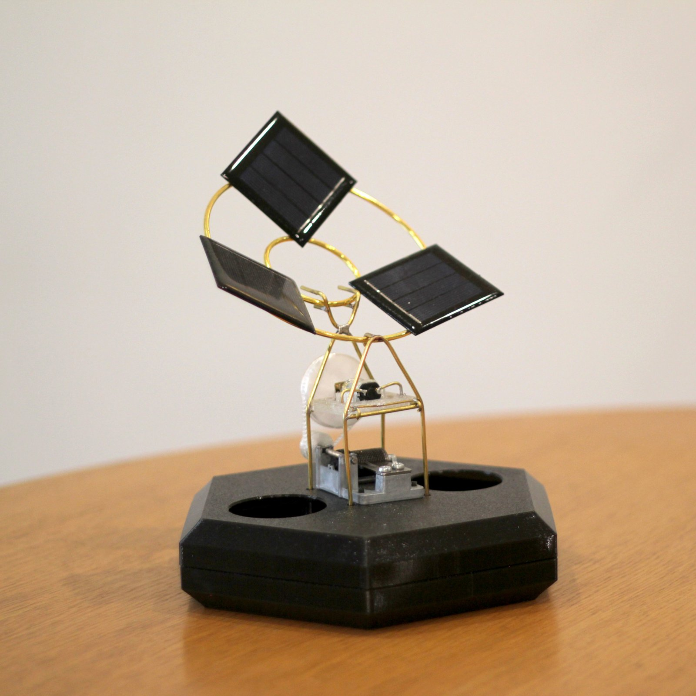
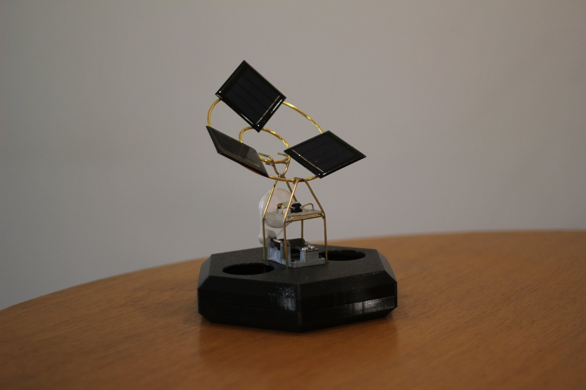
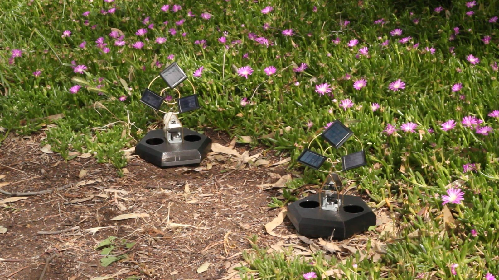
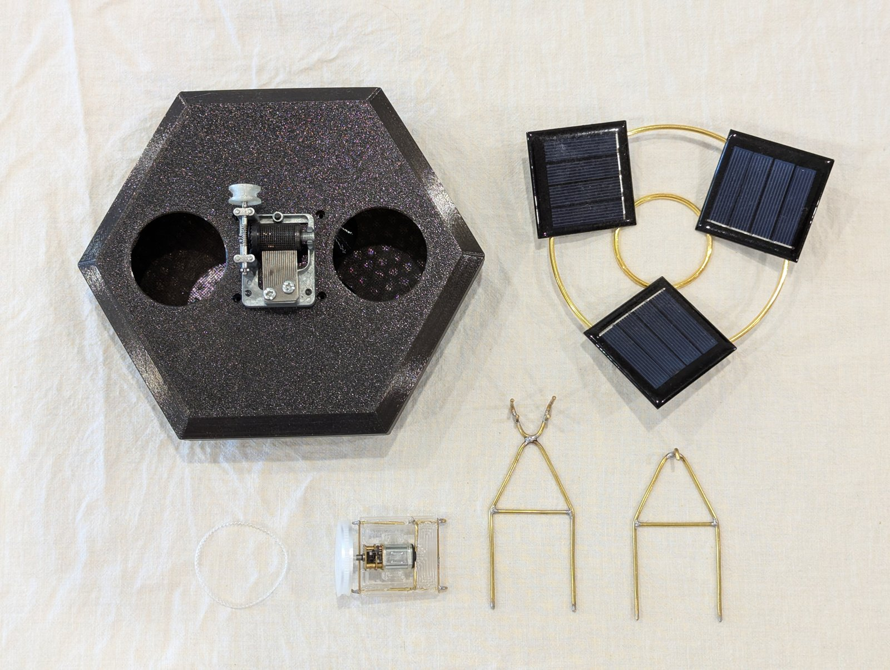
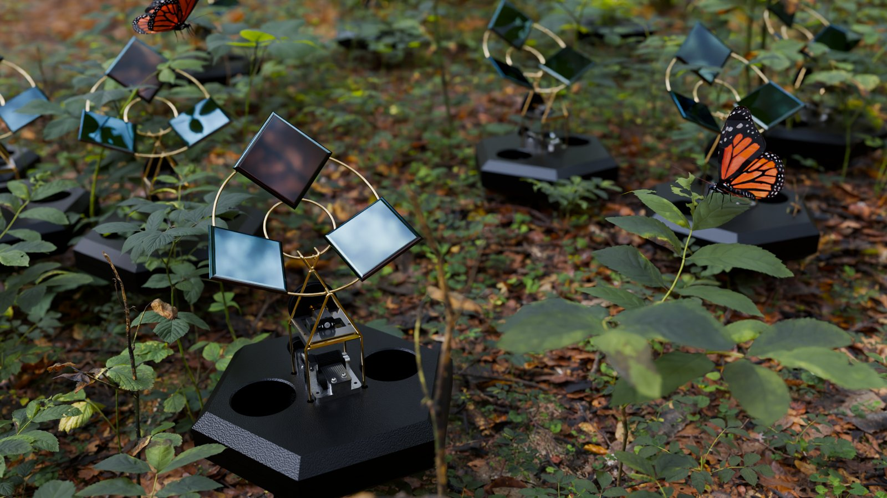
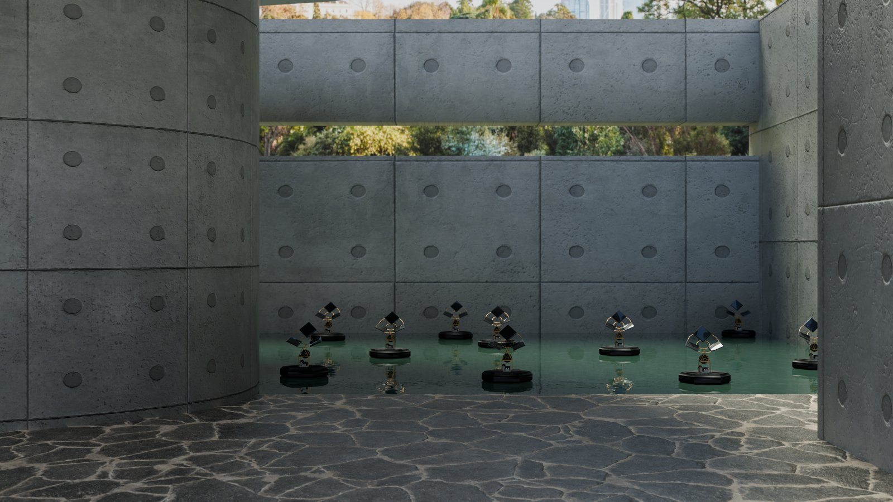
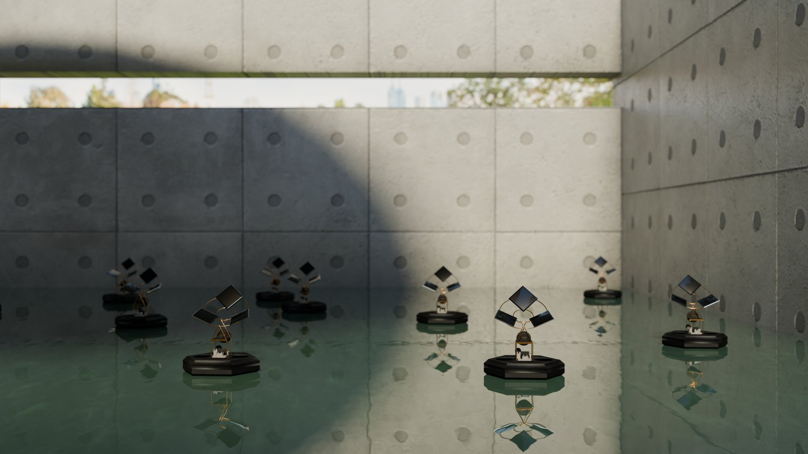
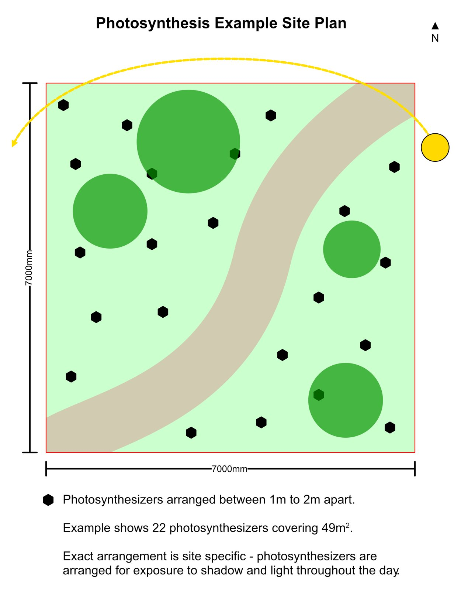



*A Field of Sound – Powered by Light*

Photosynthesis is a new immersive sound installation by Bob Jarvis. This highly scalable work is powered entirely by the sun and performed by the rotation of the earth and the movement of clouds. Dozens of solar-powered electromechanical musical instruments strum gentle chords and motifs, stopping and starting as shadow and light fall on their petal-like arrangements of photovoltaic cells. What emerges are serendipitous musical moments arising from evolving atmospheric conditions and shifting planetary alignments.

In the spirit of Buckminster Fuller, Photosynthesis is a hopeful expression of abundance and practical alchemy, transmuting sunlight into magnetism into motion into music. Music serves as a medium of connection between the inner world of the listener and the celestial cycles in which they are embedded.

The composition is built from eight musical motifs, carefully positioned to activate over the course of a day. Musical complexity emerges from overlapping phrases produced by multiple instruments en masse, starting, stopping, and shifting phase, as they react to changes in light.

- Low impact
- Requires no infrastructure
- Scaleable from one to hundreds of instruments
- Well suited to remote and natural environments
- Installable indoors in natural or artificial light

