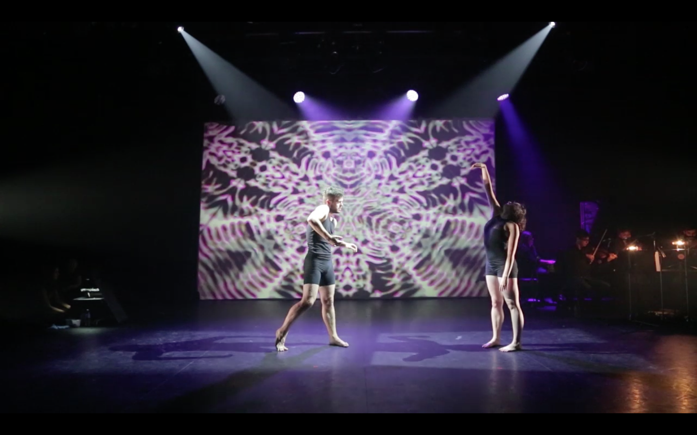
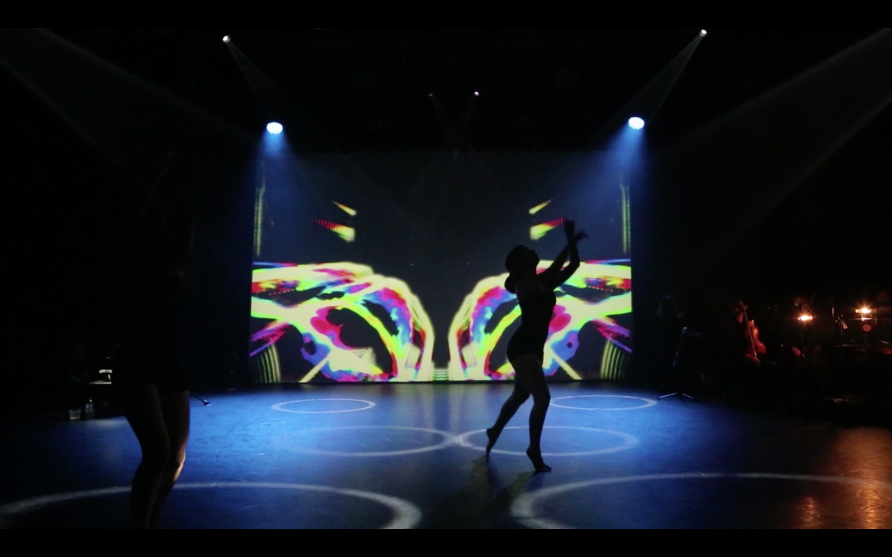
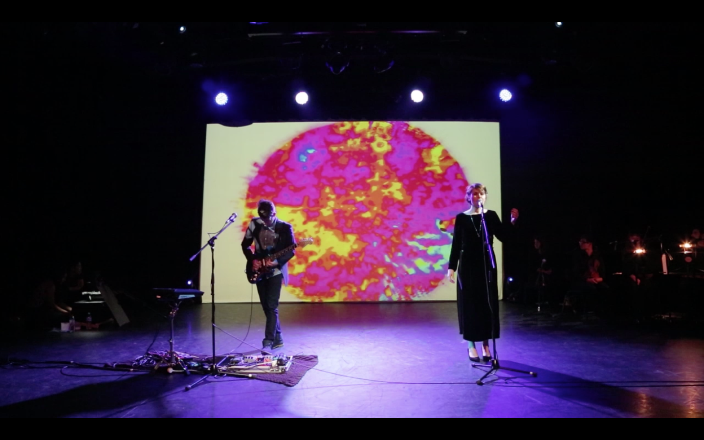

Resonance was an audio-visual multi-discipline performance written and created by Ayten Ahmet. It explored the phenomenon of [cymatics](http://en.wikipedia.org/wiki/Cymatics), the visualizing of sound vibrations in physical materials. Ayten created a sort of Cymatic instrument that allowed her to control and shape audio input to influence water, dye, cornstarch and other materials. An overhead camera fed the result to me for further processing. Shown over two nights, it proved to be a very successful performance.

<!--  -->

