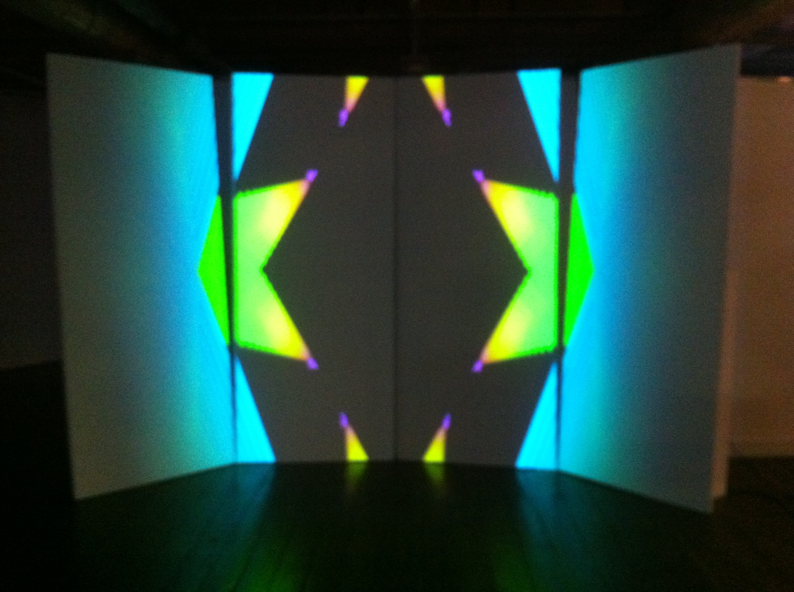
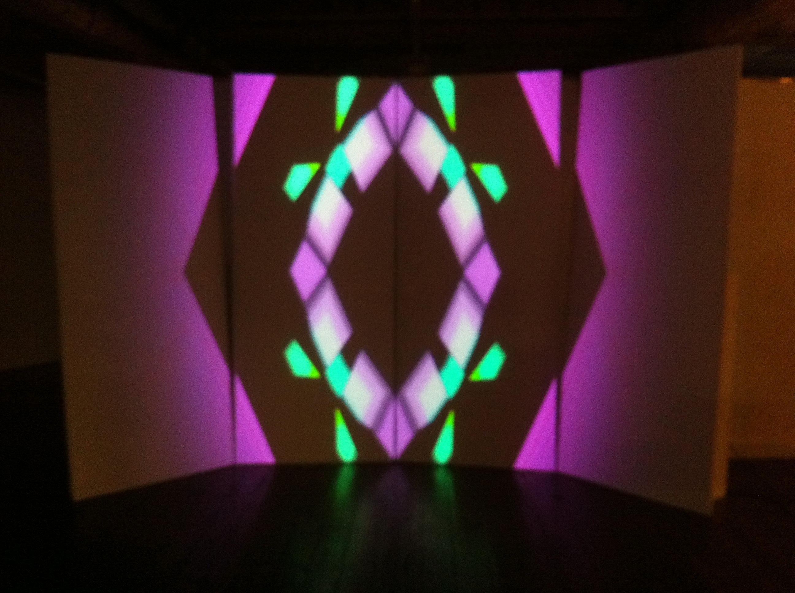
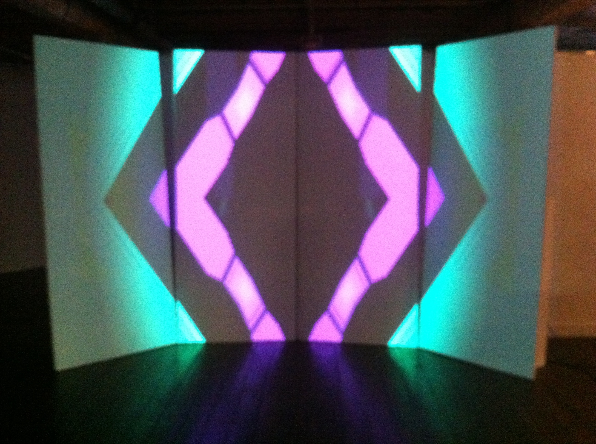
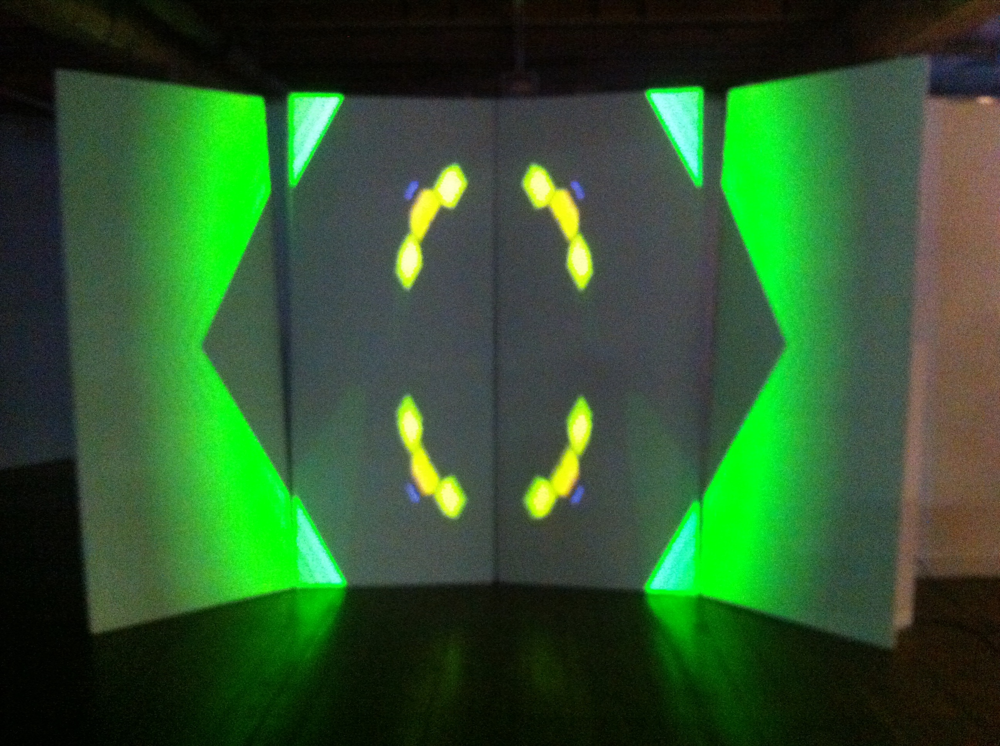
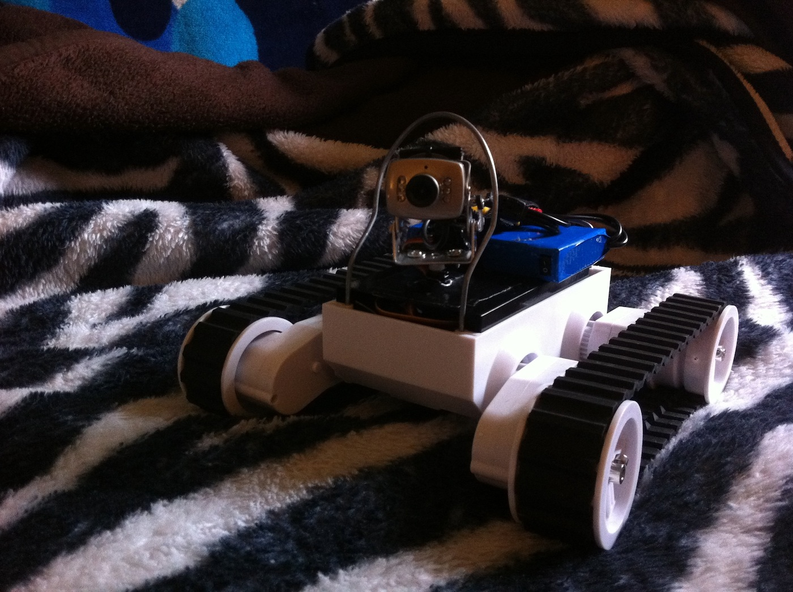

[Sound 2 Light](http://www.soundtolight.net/) was a tech/media arts event held in Hobart where artists are partnered up and given a small period of time to come up with an installation or performance. I was partnered up with venerable techno producer [Sam Gregory](http://soundcloud.com/saurekind) and we created a 20 minute AV piece revolving around strange hybrid animals all mapped onto four, large rectangular panels. I also put together two smaller installations: “Homunculus II” a teleoperated robot visible at the start of the video and a colourful, kaleidoscopic, audio-reactive projected piece that evolved throughout the night. You can also [listen to the live broadcast](http://soundcloud.com/soundtolight/sound-2-light-2011) that went out on the night.

